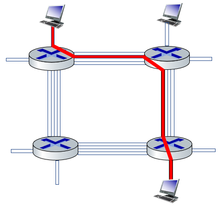
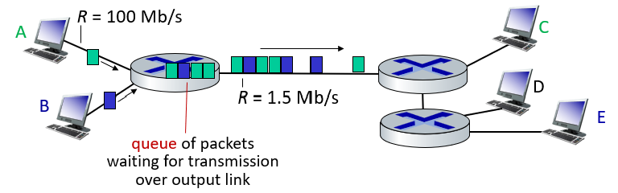
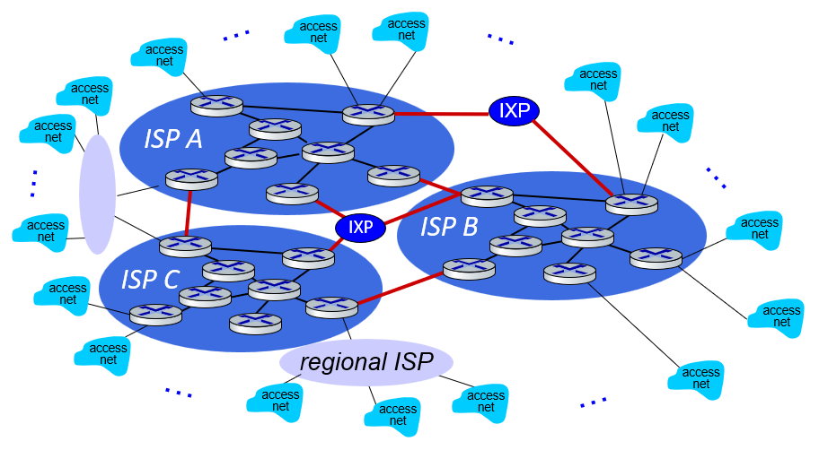

Finals Cheat sheet allowed, double sided
4 Assignments, Programming Style
- have to follow the textbook for material, not so up to date (i.e. advanced courses)
### Communications
- computer networks and postal services are cross-globe communication services
	- Internet was created via direction connection using the existing telephone network concept
- they both work over **different mediums**
- seamless abstractions (inner-working of networking abstracted away from users)
### Why the Internet
- something that we need for survival (?)
- is our connection to the world

- made by US unis, later onto US Dept of Defense
	- to ensure that **maintain communication** during nuclear war
	- made to have *reliable redundancy*

- ARPANET - Early form the the Internet
### Properties of the Internet
- Note that Internet $\neq$ World Wide Web

- The Internet consists of multiple services, whereas WWW is *one of the services*. Internet is a network of connected computing devices.

- The Internet is a type of **infrastructure** (to connect hosts or endpoints together) that provides the services to applications, not a singular service
	- Example of Infrastructure
		- **Network Edge** consists of hosts, servers (held in data centres), Smart devices etc.
		- **Network Core** consists of ISPs, Routers, etc.
		- **Access Networks and Physical Media** consisting of wired and wireless communication links (i.e. WiFi on the Ultra High Frequency range)

	- Examples of Services
		- web, video streaming, multimedia, teleconferencing, email etc.

- Hosts run network applications
	- Web: browsers $\leftrightarrow$  web servers
	- Games: clients $\leftrightarrow$ game servers
	- VoIP: IP phones $\leftrightarrow$ PBX Servers
	- BitTorrent (P2P): peers $\leftrightarrow$ trackers

### Protocols
- computers or devices use network protocols where all communication activity is governed by protocols

Define the:
1. **format and order** of messages *exchanged* (i.e. both ingress and egress) amongst entities $\implies$ parties need to conform to the standards set out in the IEEE specification
2. **actions** taken upon receiving the messages

E.g. 
- Used to have snail mail to deliver catalogues (place in envelope and send it back)
- Standard way of answering the phone and hanging up

**Protocol Examples**
- HTTP, FTP, SMTP, TCP, RTP

### Access Networks
Someone (ISP) need to provide hosts with an **access network** they can access the Internet $\implies$ Internet conduits, cell towers (i.e. the infrastructures)
- residential access networks
- institutional access networks in schools and corporations
	- typically used in companies, universities etc.. $\implies$ bandwidths or capacity of these networks are in Mbps and Gbps magnitudes
	- contains a mix of wired, wireless technologies etc.

- mobile access networks (WiFi $\implies$ Wide Area Networks, CSMA/CD, 4G/LTE technology $\implies$ Wide area cellular access / wireless access networks etc.)

- can also use cable-based access where there is frequency division multiplexing

### Physical Media
- hosts connect to the above described networks using different physical media (cable)
	- Guided media: signals propagate in solid media (i.e. fibre optic cables, UTP cables)
	- Unguided media: signals propagate freely (i.e. WiFi, Cellular data through radio waves)
### Hosts
- endpoints that send packets of data
- sending function steps
	1. Takes Application Message
	2. Breaks into smaller chunks, known as packets of length $L$ bits.
	3. Transmits packets into access network at **transmission rate** $R$ to the next node (usually a router)
		- $R$ is also known as (i) link capacity or (ii) link bandwidth or (iii) the bitrate
	 $$
	\text{Packet Transmission Delay} = \text{Time to transmit \(L\) bits to \textbf{link}} = \frac{L \text{ bits}}{R \text{ bits/sec}} = x \text{ sec}
	$$
	4. Router stores (inside its queue), processes then forwards (based on routing table) the packets to the next link

---
## Network Core
- we have a *mesh* of interconnected routers
- Fundamental qn: how is data transmitted?

### Key Network-Core functionalities
1. Forwarding
	- packet forwarding (a.k.a. switching)
	- using a local action **within the network** with the help of a local forwarding table within the router itself
		- forwards to which link number based on the header value

2. Routing
	- using a global action **w.r.t. outer network**, determines the source-destination paths traversed by the packets
		- through the use of routing algorithms

### Circuit Switching

- between each node, need to **allocate resources** and the nodes in between them must be up for the entre duration
	- no sharing of resources $\implies$ circuit segment will be **idle** if there is **no utilization**

- a call setup is required
	- there is no direct connection between endpoints, but rather, each endpoint is connected to a router that performs circuit switching
	- a dedicated electrical path is set up for communications between devices on the network
	- a single physical link between two nodes can have $\geq 1$ channel

- traditionally used in *telephone networks*
- circuit-like guaranteed performance
- divides the link bandwidth into different pieces, with both time and frequency division
	- EM waves divided into narrow frequency bands
	- each connection is on its own sub-band
	- time is divided into slots and each connection is allocated a time slot

### Packet Switching

- every node makes the **best effort** to deliver the packet $\implies$ only deals with one packet, no resource allocation needed
- each host will break application layer messages into manageable **packets**
- router routes things using the *store and forward* or *routing and addressing techniques*
	- forwarding of packets from one router to the next, across links (usually physical) from the source to the ultimate intended destination
- is used by the internet

- resources are used on demand
- excessive congestion is possible (send through much traffic to router $\implies$ but there are techniques to mitigate congestion)
#### Store and forward
- packets are passed from one router to the next in a *FIFO order*
- **entire packet** must arrive before it can be transferred
- Concept of ***Packet Transmission Delay*** is applicable in packet-switching since we break data into packets
- $\frac{L}{R}$
#### Queueing (delay)
- idea that work arrives faster than it can actually be serviced
- possible to have queue of packets at the router to wait for transmission over the output link.

**Packet Loss**
- occurs when queuing if $\text{arrival rate (bits / sec)}\:  A \gt \text{transmission rate (bits /sec)}\: R$
	- i.e. $A = 100 \text{ Mbps} \gt 1.5 \text{ Mbps} = R$
- packets can be dropped or loss if the memory router inside the router fills up too quickly.
	- router queue's size is finite
- packets are delivered in best effort, and hence delivery is **not guaranteed**
#### Routing & Addressing
- packet switching uses routing and addressing
- determines the source-destination route taken
	- address ranges that are most quickly reachable on each of the outbound links (i.e. default route)
- for addressing to work effectively, each packet needs to carry source and destination information

### Packet Switching versus Circuit Switching
- question on how many users can use the network under packet and circuit switching circumstances

**Disadvantage of Circuit Switching**
- underutilization of the link in circuit switching if not $100\%$ usage
	- packet switching is better for "bursty" data $\implies$ has data to send sometimes, but not all (i.e. $100\%$ full utilization)
- single point of failure in circuit switching

**Certain Advantage of Circuit Switching**
- **excessive** congestion is possible in packet switching
	- packet delay (when transmitting or queueing)
	- buffer overflow
- gives rise to the need to implement *reliable data transfer* and *congestion control*

- possible to make packet-switching have circuit-like behaviour

| **Circuit Switching**       | **Packet Switching**       |
|----------------------------|----------------------------|
| Setup/teardown required    | No setup/teardown required |
| Resources are reserved     | Resources shared on demand |
| Service is guaranteed      | Best effort service        |

---
## Internet Core
- hosts connect to the Internet via **access** ISPs
- access ISPs in turn need to be connected to each other (so that any two hosts anywhere can send packets to each other) $\implies$ aim to build a network instead of a complete graph w O($N^2$) complexity
- result is a complex network of networks that evolves, based on economics and national policies

**ISP Types**
- Tier 3 - ISP / Telcos (which are access ISPs)
- Tier 2 - Global and  Regional ISPs (using undersea cables) $\implies$ using Internet Exchange Points (IXP)
- Tier 1 - *Commercial ISPs like Verizon and AT&T* and Big Companies like Akamai, Google, NTT etc.

- Internet Exchange Points (locations where ISPs share equipment) and Peering links connect different ISP's networks
- CDN networks are a private network that connects its data centres to the Internet to bypass *Tier 1 and Regional ISPs*
	- brings the service contents closer to users (lower latency)
- Autonomous Systems are an organization of networks each owned by an organization (which together make up the Internet)
- Does not scale to connect each ISP to all the others $\implies$ O($N^2$) complexity
### Rules of the Internet
- Autonomous Systems have various organizations (national and international)

**Running of the Internet**
- IP address and Internet naming $\implies$ administered by NICs
- Singapore Network Information Centre
- Internet Society (ISOC) $\implies$ Internet-related standards, education and policy
- Internet Architecture Board which issues and updates technical standards regarding Internet Protocols
	- Internet Engineering task Force (IETF) $\implies$ is a branch of IAB
		- does ***protocol*** engineering, R&D, standardization etc.
		- standards are published as RFCs

### Communication Links
- is a bi-directional point to point connection with one party on each side
- allows for data be transmitted or nothing to be transmitted (idle)
- has *propagation delay* (refer to the below)
- operates at a certain, **constant bitrate** (i.e. bits / sec)
	- is the link throughput, determined by the technology of the link

---
## Delay, Loss and Throughput Networks
- how is network speed measured 
	- what does it mean by faster $\implies$ water pressure? or volume of water?
### Packet Loss
- the packets will queue in router buffers (to wait for their turn to be sent out one by one)
- router queue or buffer which *precedes the link* has a **finite** capacity
- lost packet may or may not be retransmitted by the previous node or the source
### Packet Delay
Four main sources of delay within a single hop (from one router to another)
$$ 
\begin{aligned}
D_{\text{nodal}} &= D_{\text{proc}} + D_{\text{queue}} + D_{\text{trans}} + D_{\text{prop}} \\\\
D_{\text{end-to-end}} &= \sum D_{\text{nodal}} \\
&= 2 \times \frac{L}{R} \quad \text{assuming no other delay besides } D_{\text{trans}}
\end{aligned}
$$
1. Nodal **Processing**: time to read the packet and where to send the packet to (processing delay)
	- "check the bucket"
	- checking for bit errors (at each hop), using checksum or CRC mechanisms
	- choosing which output link to place the packet on

2. Once it is determined, then the packet will **Queue** (queueing delay)
	-  "wait for turn" at output link for transmission
	- depends on the congestion level of the outbound link
		- imbalance of ingress and egress traffic

	- queueing delay can be given by the formula $D_{queue} = \frac{L \cdot a}{R} = \frac{\text{Arrival Rate of bits}}{\text{Service Rate of bits}}$
		- delay $\approx 0 \implies$ small *average queueing delay* is present
		- delay $= 1 \implies$ average queueing delay is large
		- delay $\gt 1 \implies$ more packets are arriving than what can be serviced, or that the average queuing delay $\infty$

	- able to use programs like traceroute to provide delay measurements of delay from source to router $i$ along the path of delivery
		- `*` means no response (i.e. probe is lost or the router is not replying with information due to security reasons)

3. **Transmission** Delay: time taken for entire packet to be transmitted from one router to another
	- The medium determines how much you can stuff into the cable
	- "time taken to pour into pipe"
	- given by $\frac{L}{R} = \frac{\text{Pkt Size}}{\text{Link bandwidth}}$

4. **Propagation** Delay: Time taken for one bit to travel through the medium to the other end (is ***at most*** the speed of light)
	- time taken from sender to receiver or "time taken to travel across pipe"
	- a.k.a. the link latency, often determined by the length of the link
		- also may be affected by the resistance of the wire etc.
	- Given by the formula $\frac{d}{s}, \: s = 2 \times 10^8 \text{ m/sec (if not given)}$

Note that transmission delay and propagation delay are ***associated with the link*** itself.
### Throughput
- how many **bits** can be transmitted *per unit time*
	- measured for **end-to-end** communication
- different links may have different link capacity (or bandwidth)
	- measured as $R_i \text{ bits / sec}$

- can be measured in two forms
	- instantaneous $\implies$ the rate of bits for a given point in time
	- average $\implies$ rate of bits over a longer period of time

> A **bottleneck link** is a link on an end-to-end path that *constraints* the end-to-end throughput

- we use metric units to measure throughput (principal metric prefixes) and powers of $10$, not powers of $2$
---
## Protocol Layering and Service Models
- each protocol layer provides a different service (or job)
- layering enables us to deal with complex systems
- allows for simple interfaces between layers
- abstract implementation from each other

**Examples**
- Application (HTTP, assume no QUIC so default to TCP in transport)
- Transport (TCP, UDP)
- Network (IP)
- Link / Physical Layer (Ethernet)

- one container TEU $\implies$ used for shipping
	- Internet uses packages as well, which uses MTU (MSS $\lt$ MTU)

---
## Security
- where got time to implement security?
	- Internet not originally designed with much security in mind

- needs to be implemented at **all layers**

**Threats to Security**
- packet sniffing via promiscuous mode (with the network interface being able to read all packets and decode unencrypted data)
- IP address spoofing: injection of fake `src_ip`
- Denial of Service attacks: make resources such as server bandwidth $\not R$ unavailable
