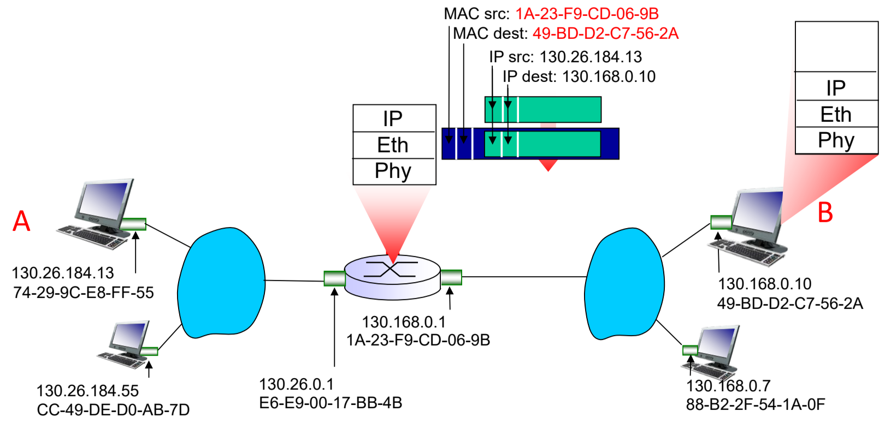

- building a network that only spans our office or dorm
- how to connect $N$ nodes via a single cable
- why do we need to have a protocol
	- error detection and recovery (not the primary concern)
	- need to access the shared medium (access control)

- need to know who the packet is for
	- introduces error detection, frame construction and link access control

- a hub allows us to connect all the nodes in the network (a more stupid switch)
	- hub can be use to connect $\geq 1$ hubs (rather than connecting to the nodes themselves)
- network can be restricted by the length of cables (maximum length of the diameter of the network)
## Introduction to LAN
- LAN is a network that spans within a geographical area (usually a building or university campus)
- can have multiple subnets inside of it
- is not defined by the technology (can be implemented using $\geq 1$ technologies)
### Ethernet
- is the dominant wired LAN technology
- is cheaper and simpler than the IBM token ring and the ATM model
#### Ethernet 802.3 Standards
- is a family of standards developed over the years
- have the same MAC protocol and frame format
- different speeds and physical layer media
- everything is implemented on the NIC card
- Suffix of `X` $\implies$ fibre
- `T` $\implies$ twisted pair physical layer cables
#### Ethernet Frame Structure
- consider the case of sending IP datagram to the next hop on the same ethernet
- the sending NIC adapter encapsulates IP datagram in the Ethernet frame
- can only send the data to a node **within the same subnet** (cannot send outside the subnet)
	- is the job of network layer to make sure it reaches the recipient

**Components:**
- Preamble
- `src_addr` : 6 byte MAC address
- `dst_addr` : 6 byte MAC address
- `type`
- Data $\implies$ 1500 bytes
- CRC

**Type**
- Ethernet and IP are not the only protocol with a dependence relation
	- need to keep in mind that hosts can use other network-layer protocols besides IP (i.e. ARP)
- permits ethernet Ethernet to multiplex network layer protocols

**Preamble**
- indication that we are sending an ethernet frame
- having a clock and having all devices synchronized is an expensive task
	- the patterns of $7 \times 10101010_2$ to indicate that we should synchronize the clocks
	- clock should be good enough to maintain its synchronization for $\geq 1500$ bytes

**Length, min and max length**
The size of the frame is bounded by the upper and lower limits of $[46, 1500]$
- MTU $= 1500$ bytes
- MTU = MSS + IP Header + TCP Header

What is the size or the length of the data?
- there is something called the Inter-frame gap which is introduce to demarcate the end of a frame
#### Ethernet Data Delivery Service
- is inherently unreliable: receiving NIC doesn't send ACK or NACK
	- data in drop frames will be recovered only if initial sender uses higher layer rdt (i.e. TCP), otherwise dropped data is lost (up to higher layer to implement reliability)

- ethernet multiple access protocol: using CSMA/CD will binary backoff

#### Ethernet Bus Topology
- is a broadcast LAN (all transmitted frame received by all adapters connected to the bus)
	- all nodes can collide with each other

- single point of failure (backbone cable)
- difficult to troubleshoot problems
- very slow and not ideal for large network $\implies$ collisions
#### Ethernet Star Topology
- more prevalent today, with a hub (works at the physical layer)
##### Hub
- a hub is a physical layer device that acts on a individual bit level
- costs of having a star topology (look at the disadvantages)

**Advantages**
- cheap
- easy maintenance (modular in nature)

**Disadvantages**
- limited by # ports (not exactly a drawback)
- still a single point of failures
- number of cables
- still have lots of collisions (realm of broadcast medium)
##### Switch
- is a layer 2 device
	- works on frames rather than individual bits
	- store-and-forward
		- it has buffers and waits for the entire frame to arrive before forwarding

- does not amplify signals, but rather works on frames
- has no collisions
### Ethernet Switch
- link layer devices used in LANs
	- examine the incoming frame's MAC address and selectively forward the frame to one-or-more outgoing links
- stores and forwards ethernet frames
- uses CSMA/CD to access link

- is a Transparent
	- hosts are unaware of the presence of the switch (appears to be going directly to the next hop)

- is plug-and-play (self-learning) $\implies$ switch don't require configuration

- remove collisions, thus network is much faster
#### Multiple Simultaneous Transmissions
- nodes have a dedicated, direct connection to the switch $\implies$ have **no collisions**, but CSMA/CD is maintained for backward compatibility

- every interface has an incoming and outgoing buffer
	- transmitting the frame is merely just doing a memory copy operation from the incoming buffer to the outgoing buffer
	- can simultaneously transfer packets multiple different hosts, but cannot simultaneously transfer to the same host

- format of entry in switch table:
	- `mac_addr`,`interface_id`, `ttl`
	- `ttl` fields ensures the entry does not go stable

- self-learning property of the switch
	- we have a mapping on the `src_MAC` address to the interface
	- if $\not \exists$ entry for a particular mapping, then we store the packet in the buffer first
		- send to all the other interfaces except for the one that it was sent from

- switch has only can recreate data packets, and it does not have a MAC address

- switching table entries are updated upon broadcast

**Scenario**
1. receive packet, where `dst_addr` unknown
2. receive packet, where `dst_addr` known
3. filter or drop packet

- MAC address $\implies$ only need unique one hop (i.e. Virtual Machine to host comms)

## Interconnecting Switches
- switches **must** be connected in a **hierarchy** in a spanning tree
	- should ensure that the topology takes the form of a spanning tree
	- should not have loops in it (due the the lack of the TTL field in ethernet frames) $\implies$ packet could get stuck in the network
		- switches are overloaded
		- switch buffers has overflown (both the one accepting ingress and giving out egress packets are overflown) $\implies$ occupied by packets that **do not need servicing anymore**
		- buffer size keeps getting reduce in each iteration (and eventually will run out due to the **finite size** of the buffer)

- there are no hops in a LAN, everything is a **single hop away** (we are only concerned with this model and let the above layers handle multi-hop)

---
### MAC Address
- every network interface has a MAC address (a.k.a. physical or LAN address)
	- used to send and receive link layer frames
	- **uniquely identify** each of the interface cards (both the sender and the receiver)
		- primarily used for filtering packets based on the addresses

- when adapter receives frame, checks if `dest_addr` matches its own MAC address
	- if **yes**, then **extract** enclosed datagram and pass it on to next level in protocol stack (network layer)
	- if **no**, then just **drop** the datagram (discard operation), without interrupting the host

- is typically $48$ bits (i.e. $6$ bytes) long and burnt into the NIC ROM
	- is in hexadecimal notation (first $3$ bytes are vendor specific)
	- exceptions whereby sometimes it is software-settable / configurable

**Special MAC Addresses & Allocation of MACs**
- `FF-FF-FF-FF-FF-FF` $\to$ broadcast address
- MAC address allocation (by blocks) is administered by IEEE
	- 1st $3$ bytes: vendor or OEM of NIC adapter
	- Last $3$ bytes: specific product (i.e. $\approx 16,777,216$)
		- `00-00-00` to `FF-FF-FF`

	- every device has a **globally unique MAC address** (including virtual network cards)

| **Address Type** | **Length** | **Purpose**                                                                                                    | **Nature**                                                                                 |
| :--------------- | :--------- | :------------------------------------------------------------------------------------------------------------- | ------------------------------------------------------------------------------------------ |
| **IP address**   | 32 bits    | Network-layer address used to move **datagrams** from *source to destination* (multiple links, multiple hops). | - Can be dynamic or statically configured  - Hierarchical (for facilitating routing) |
| **MAC address**  | 48 bits    | Link-layer address used to move **frames** over every **single link**.                                         | - Permanent, cannot override (identifies the hardware)  - No sense of Hierarchy      |

**Why use IP Addresses instead of MAC for routing?**
- forwarding table stores the unique prefix, instead of storing every single unique MAC
	- significant reduce the size of forwarding tables by using systematic IP allocation $\implies$ allow for **Address Aggregation**
	- mapping saved is unique IP prefix : link to fwd to (minimal in nature)
	- mapping doesn't help with address aggregation and hierarchy

- furthermore, people move around, then how to go about registering MAC at each new location / network for the routing service?
	- not guaranteed that every machine in our network has the same manufacturer
## Address Resolution Protocol (ARP)
#### Motivation
- Link Layer: want to transmit data over only a single hop (between adjacent nodes over a single link)
	- IP Datagrams are encapsulated in link-layer frames for transmission (need to rely on IP addresses)

- can use DNS to get the mapping from `hostname`: `IP address`
	- still need to get `IP address`: `MAC Address` (for each hop) $\implies$ what is `dst_MAC`
#### Features of ARP
- provides a query mechanism to learn an endpoint's MAC address
	- query a MAC address for a **given IP Address**
	- don't wish to query the MAC address for every single datagram to be sent

- each IP node has an ARP table which stores:
	- **`IP address`** (32 bits) **: `MAC Address`** (48 bits) **: `TTL`**
	- `TTL` is usually a few mins, ensures entry don't look stale
	- sometimes includes *type* field as well

- `__gateway` refers to the destination MAC of the default gateway

- for any IP communication to occur (above the link layer), we need to know the **corresponding next-hop MAC address** to send to
	- MAC address used to construct the Ethernet frame which encapsulates the IP datagram (otherwise IP comms is impossible)
	- any new mapping done with ARP will result in a new entry for a particular `IP : MAC: TTL` $3$-tuple in the ARP table (i.e. `ping` command issued to IP in local subnet)

	

#### Sending Frames within the same subnet
- can send directly (switch is considered to be invisible), there are **no intermediate nodes** (no router required in between)
- ARP is a plug-and-play protocol (no configuration required by network admin)
	- only coordination required is for the nodes to all run ARP protocol themselves (reply $\leftrightarrow$ response)

**Case 1**
- A knows B's MAC from its ARP table (i.e. $\exists$ a corresponding entry)
- A can directly create an ethernet frame with B's MAC address as `dst_MAC` and send it
- only B will process this frame, while other nodes will **receive and discard**
	- this is assuming the switch does not have a corresponding entry of the destination device by its corresponding link, or that the device connecting the nodes via link is a hub (broadcast every time)
- frame could also be directly forwarded to B if $\exists$ a switch table entry for the destination MAC address

**Case 2**
- A knows B's MAC  (i.e. it is the first request to comms with B, $\not \exists$ a corresponding local ARP table entry of A)
- A broadcasts the ARP query packet containing B's IP address
	- `dst_MAC` is set to local broadcast `FF-FF-FF-FF-FF-FF` (across the LAN, broadcast domain)
	- All nodes in subnet will receive this ARP query packet, but **only host B would reply to it**, the rest *will discard*

- B **replies** to A with its corresponding MAC address
	- `src_MAC` is B's MAC, `dst_MAC` is A's MAC (to be received for processing)

- A **caches** B's **`IP:MAC` mapping** in its ARP table until the **TTL** of the record **expires**

#### Sending frames to another subnet
- A in net 1, B in net 2
- A creates an IP datagram with `src_ip` of A, `dst_ip` of B
- use **ARP** to find the corresponding MAC from the IP of the **default gateway** (if not already in the )
- A creates frame encapsulating IP datagram with `src_MAC` of A, ==`dst_MAC` of router R's internal interface==, connected to net 1(`__gateway`)
	- we cannot indicate `dst_MAC` to be B because it is not within the subnet / broadcast domain of net 1 and there is **no such IP address** corresponding to the ARP request **in the subnet** (i.e. will get discarded, due to mismatch of destination MAC $\to$ none of the nodes in net 1 have that MAC address)
- frame is sent from A to R

- frame arrives at router R, the frame is removed and passed up the layer to IP protocol 
- R forwards datagram with `src_ip` of A, `dst_ip` of B
	- router replaces the `dest_MAC` with that of B instead of R, `src_MAC` is that of the **outgoing router link** when creating the new frame (external interface connected to net 2) $\implies$ only valid within net 2, or the subnet itself
	- the IP datagram embedded remains intact (i.e. no change)

	

## Conclusion
- Ethernet Technologies
- Ethernet Switches and Switch tables
- Journey down the complete protocol stack