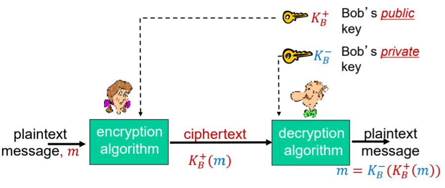

## A. Motivation
- connection to network $\neq$ connection to the Internet
- when troubleshooting the network, we should go up the protocol stack
	- check the link first (if it is up)
	- recursively move on up to higher layers and troubleshoot each one individually to find the issue
		- network layer issues: wrong router config, DHCP is not there, DNS does not work
		- transport layer issues: think of errors both at the server or client end (one of them is down, firewall block port, NAT router has no free ports)
			- NAT router is not a router only, per se (does routing and more)
		- app layer issues: application tells you what is wrong

- Internet was built whereby we assume that everyone is a good guy (no interest in manipulating or disrupting communications between parties)
	- bad assumption to make, hence
	- need to retrofit the TCP/IP protocol stack **with security** as the channel is inherently insecure

- make sure we have a TCP/IP Client-Server program 
	- connected using sockets but we don't care about the underlying API
### Conditions and Controls
Need to provide countermeasures for the following problems. We cannot solve eavesdropping or impersonation per se, but we can **detect it**
1. **Eavesdrop** $\implies$ compromise of Confidentiality (your data stays private, $3^{rd}$ parties cannot understand)
	1. Confidentiality $\to$ if Alice and Bob are talking, no one else has knowledge of the **contents of the conversation** (not so much the existence)

2. Delete/**Modify**/Add **messages** $\implies$ compromise on Integrity
	1. We want our message to not be altered, **without detection**
	2. We cannot control the channel (the intermediate nodes), but we can **detect** modifications

3. **Impersonation** (Authentication)
	1. You are who you say you are (have some means of verifying or confirming the identity)

4. Compromise on **Repudiation** (Authentication)
	1. deny ever transmitting that message (start controversy)

Security is implemented at **every layer of the network stack.**
- DNS and IP level has inherently no security baked in (need to have a consideration for this)
- we could use it at any layer theoretically
	- we want to define the engineering techniques to implement security in the layers of the network stack
#### Problems of Network Security
- Confidentiality
- Integrity
- Availability
#### Where to implement Network Security
- getting mappings from DNS servers
- online client-server banking applications
- routers exchanging routing table updates (bogus routing entries based on minimal, unverified routing cost)
#### What can attackers do
- **eavesdrop**
- **insert messages** (or delete / modify) into connection: buying or selling a stock you did not intend to
- **hijack** conversations: replace either the server or the client
- **denial of service**: many countries consider disruption of network as an act of war
#### Security as a Trade-off
- Absolute Network Security is easy to achieve (just disconnect everything from Internet) $\implies$ physical separation from the Internet but,

- Absolute Network Security is hard to achieve when we need to allow all services

- Good Security is about **risk management**
	- work with constraints to maximise services, balance cost, usability and convenience of our services
	- trade-off for more security even though it may not make much sense (jeopardise convenience and intuitiveness for users)
## B. Cryptography
- **Confidentiality:** if code language is secret, the MiTM *cannot understand* it
	- may have solved it when we use simple crypto methods like using a book cipher (under reasonable assumption)
	- encoding of the cipher is public and open source

- **Authentication:** if code language is secret, only Alice and Bob can write it
	- cipher is not broken and keys are not leaked

- **Integrity:** If the code language has an inviolable property
	- end with something, something that is deterministic
	- any modification of the language will violate this property which makes it void and invalid after transmission

- creating a "secret" language or code words or languages
	- every individual piece of a message is "irrelevant"
	- **disguise** the message so that MiTM can gain no information of the intercepted data
	- ⚠️ should be able to **recover** (decrypt or decode) the information into its original form from the disguise data
	- balancing complexity of encryption and simplicity of decryption

- Cryptography can be used to implement the property of data confidentiality and Digital Signatures, the property of data integrity
### B1. The Language of Cryptography
The process of sending and receiving messages over insecure channel
- Alice encrypts plaintext $m$ to be sent with her key $K_A$ to obtain $K_A(.)$
- ciphertext $K_A(.)$ is sent through an **insecure channel susceptible to eavesdropping and interception**
- Message arrives at Bob (recipient). Bob decrypts ciphertext with his key $K_B$ to decrypt the ciphertext $c$ into the resultant plaintext message $m$

**Notations**
- $m \implies$ plaintext message
- $K_A(.) \implies$ encryption algorithm with key $K_A$
	- $K_A(m) \implies$ resultant ciphertext as a result of encryption, to be send over the insecure channel

- $K_B(.) \implies$ decryption algorithm with key $K_B$
	- $m = K_B(K_A(m)) \implies$ obtaining the original plaintext message from decrypting the ciphertext received

- there may be a problem of invertibility, but we assume that the encryption can be inverted

**Problem**
- *abuse of notation*: i.e. $K_A$ is used in the overloaded sense as the encryption algorithm, as well as the key that was used in encryption of the plaintext message
	- should be mindful of the context of when $K_A$  is the key and when is the algorithm (for encryption)
		- encryption $\to \times$
		- decryption $\to \div$

	- abuse of notations help us to reduce the clutter of the notations that we have to use

**Things to agree on** 
- even though we are using a *public channel*, we need our communications to be private
- before any secure connection, we require a handshake across the insecure channel (which may not necessarily be always secure in nature)

- Need to agree upon the following:
	1. encryption and decryption *algorithm*
	2. the *keys* which they use, $K_A$ and $K_B$

- even if the above information are made public, the communication is still designed to be secure (use another media or protocol for key distribution)
### B2. Symmetric Encryption
- The sender and recipient use the same key for encryption and decryption
	$K_S$ is **unique** for each pair of individuals (strong property)
- Key exchange (distribution) is a problem in this case

#### Stream Ciphers
Example: **Caesar Cipher**
- is a form of a substitution cipher, where we substitute one thing for another (using a mapping table)
	- key takes the form of a mapping table or the permutation (is a **symmetric key**)
	- there are $26 - 1 = 25$ possible keys

- substitute the **whole block** at once
- shift a number of positions to obtain the ciphertext and shift the ciphertext a fixed number of positions to obtain plaintext
- Weakness: we can brute force

Example: **Monoalphabetic Cipher**
- we shift each letter by an arbitrary number of positions (**not** every letter in plaintext is shifted by a **fixed amount**)
- the permutation is again the key
- we have $26! - 1$ or $\approx 10^{26}$ keys

- **Weakness:** can be broken through statistical analysis (analysing the frequency of letters that appear in the alphabet and attempt to guess the corresponding mapping)
	- i.e. `e` and `t` are the most frequently used letter (individual level)
	- can also guess based on how the letters are group with each other (i.e. `in`, `it` for potential $2$-letter words delimited by space etc.)
	- knowing what the two parties could send

Example: **Polyalphabetic Cipher**
- solves the problem that Monoalphabetic has, by having **multiple mappings**  $\geq 1$ key for a chosen plaintext letter
	- we $n$ substitution ciphers $C_1, C_2, \ldots, C_n$, but we **mix the ordering up (cycling pattern)**
	
#### Attacks to break Symmetric Encryption
1. Cipher-text only attack (only has the ciphertext to work with and nothing else)
2. Known-plaintext attack (have a known plaintext and the corresponding ciphertext $\implies$ easier because can easily reverse and get the key or mapping)
3. Chosen-plaintext attack (get one of the parties to send a certain plaintext)

4. Main weakness of Symmetric Key Encryption: 
	1. it is deterministic
	2. ==key exchange problem== (is a very difficult proposition) $\implies$ need to know a shared key
#### Block Ciphers
- the message to be encrypted is processed in blocks of $K$ bits
- if $K = 64 \implies$ message is broken up to $64$-bit blocks
	- for the last block, if size is not exactly $64$, then we pad those (usually with null bits, but need to have mapping for this so don't accidentally turn into something else)

- the key in this case is the mapping table of inputs to outputs, as well as the value of $K$-bits which the message is chopped up into
	- we have $2^K!$ possible keys
##### Data Encryption Standard (DES)
- 56-bit symmetric key for 64-bit blocks
	- DES is not secure, as the $56$-bit key can be brute forced in less than a day
- make DES more secure by implementing 3DES which uses 3 different keys and 3 rounds of encryption
##### Advanced Encryption Standard (AES)
- what is used today and replaced DES
- works on $128$-bit blocks, but the key sizes vary $\to$ 128, 192 or 256 bit keys
- cannot be broken in a reasonable amount of time
### B3. Asymmetric Encryption (Public Key Crypto)
- idea that anyone can encrypt and send a message to Alice (though the slit in her letterbox)
	- **public key** belongs to Alice is shared to the world (anyone who wants to communicate with Alice must use this key)

- only Alice can decrypt the message (by opening the letter box with the key that only she has)

- solves the problem of key distribution
	- how do we agree on what key in the first place if the two parties have not "met"?

- sender uses recipient's public key which is known to all for encryption of the message
- receiver uses his/her own **private key** for decryption of the message
	- notation: $K_x^+ \to$ public key, $K_x^- \to$ private key
	- private key is only **known to the owner** of the key

#### Public Key Encryption Algorithms
Require the following:
1. The recipients private and public encryption algorithms $K_B^-(.)$ and $K_B^+(.)$, such that $m = K_B^-(K_B^+(m))$
	1. algorithms should be able to invert or reverse each other's operation
2. It should be **impossible** to derive the public key $K_B^-$ from the public key

- The requirements of PK Encryption / Infra is still the same: send the message as a ciphertext over the insecure channel
### Rivest-Shamir-Adleman Algorithm (RSA)
- uses the fact that it is very hard to factorise large prime numbers
- is a very **computationally expensive** process (to generate the key pair)
	- does not make sense to use RSA to encrypt large amounts of data
	- DES (symmetric) is $\approx 100 \times$ faster than RSA, but requires the prior knowledge of the shared symmetric key $K_S$
##### Steps
1. Given $(n, e)$ and $(n,d)$
2. To encrypt the message $m$ s.t. $m \lt n$, we compute:
$$
c = m^e \text{ mod } n
$$
3. To decrypt the bit pattern of the ciphertext $c$ back to the plaintext message $m$, we compute:
$$
\begin{aligned}
m &= c^d \text{ mod } n \\
&= (m^e \text{ mod } n)^d \text{ mod } n \qquad \text{(see value of c from above)}
\end{aligned}
$$
- Can instead use symmetric key encryption after using RSA
	- use the strength of one to counter the weakness of the other
	- how to do it?
		- select a **session key**, which is *symmetric* $K_S$
		- first data message is the encrypted symmetric key to be used for further communications
		- use $K_S$ as the symmetric key in DES for encrypting the data
	- the problem of symmetric key distribution will be solved

- used in HTTPS (HTTP w SSL), SSH
	- fingerprint of the public key $\implies$ the recipient provides the sender (SSH client) with the public key in the first instance
	- public key is used each time to start a session

- the exponent for the RSA math changes from $d$ to $e$ with respect to decryption and encryption operations respectively
	- good property worth exploiting
#### Math behind RSA - Modular Arithmetic
The expression: $x \text{ mod } n$ means that we take the remainder of the operation $\frac{x}{n}$ or $x \div n$
- some properties:
	- $(a \text{ mod } n) \pm (b \text{ mod } n) = (a \pm b) \text{ mod } n$ (both for addition and multiplication)
	- $(a \text{ mod } n) \times (b \text{ mod } n) = (a \times b) \text{ mod } n$

	- $(a \text{ mod } n)^d \text{ mod } n = a^d \text{ mod } n$

RSA works in the realm of numbers and so a message $m$ is just a bit pattern of numbers to be encrypted
- any bit pattern can be **uniquely represented** by an integral number
- encrypting a message is equivalent to encrypting a number

- encrypts the ASCII or whichever encoding
#### Math behind RSA -- creating the public-private key pair
1. choose two very large primes $p, q$

2. compute $n = p \times q, \: z = (p-1)(q-1)$
	1. note that $n$ and $z$ are composites, and $z$ is always **even** unless $p=q=2$ (which is unlikely)

3. randomly choose the value $e$. where $e \lt n$ that has **no common factors** with $z$ (recall $z$ is a composite). s.t. $e$ and $z$ are relative primes (i.e. $gcd(e, z) = 1$)
	1. choose a **prime number** that is smaller than $n$ (which won't have any shared factors with $z$, except for $1$)

4. choose a number $d$ s.t. $\: e \cdot d \text{ mod } z = 1$

5. At the end of this, we have chosen $4$ numbers
	1. $p, q$ which are primes
	2. $e$ which could be a prime (could be the same as $p$ technically)
	3. $d$

6. We **only** reveal $(n,e)$ as the public key $K_B^+$ and $(n,d)$ as the private key $K_B^-$ which is kept **secret**
	1. $d$ is technically the only real secret part of the key
	2. we do not reveal the values of $p, q$ as well

7. Use the steps above to do the encryption or decryption

**Sample**
1. $p = 5, q = 7$

2. Compute $n = 5 \times 7 = 35, z = 4 \times 6 = 24$

3. Let $e = 5$, which fulfils $e \lt n \iff 5 \lt 24$ and $e \neq k\cdot z$

4. Let $d = 29$ s.t. $\frac{e\cdot d}{z} = \frac{29 \times 5}{24} = 6\frac{1}{24} \implies$ $(e \cdot d) \text{ mod } n = 1$

To encrypt: 
- $m = 12$
- $m^e = 12^5$
- $c = m^e \text{ mod } n = 12^5 \text{ mod } 35 = 17$

To decrypt:
- $m = c^d \text{ mod } n = 17^{29} \text{ mod } 35 = [(17^{5} \text{ mod } 35)^5  \times (17^4 \text{ mod } 35)] \text{ mod } 35 = (12^5 \times 11) \text{ mod } 35 = 12$

**Important Property worth noting:**
- composing the functions that are invertible (results are the same)
$$
K_B^-(K_B^+(m)) = m = K_B^+(K_B^-(m))
$$