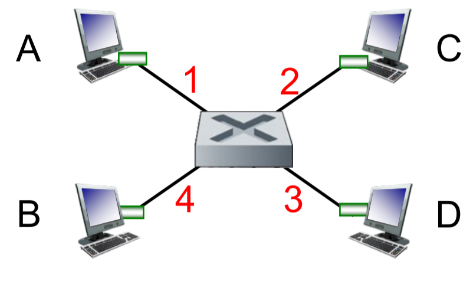
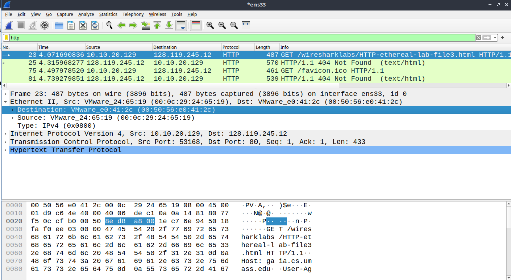

## Lecture Review
### Topic 1: LAN and Ethernet Standards
- LAN is a network that covers a geographical area (could consists of multiple subnets)
	- subnets need to communicate using an intermediate router

- Ethernet Standards
	- are a group of standards for link layer communication between physical adjacent nodes (one hop)
	- share the same frame format and MAC protocol

- MAC Address is a $48$-bit address unique to each NIC adapter
	- NIC adapter is the physical implementation of the link layer infrastructure

### Topic 2: Ethernet Topology
1. Bus topology
	- single cable is used to connect all nodes and all messages are broadcast within the network

2. Star topology (no switch)
	- all node is connected to a central node (which can vary $\to$ can be a hub)
	- hub will boost the signal and broadcast to the rest of the links

3. Star topology with switch
	- all nodes connected using switch, able to selectively store and forward

### Topic 3: Ethernet Switch
- maintains the switch table, which stores the mapping in the form of a $3-$tuple:
	- (MAC Address, Interface which specific host is reachable, TTL)
	- whenever the switch receives a new packet, it will store the new mapping into the switch table

- 3 possible cases:
	- dest MAC $\in$ switch table, dest interface same as sender interface $\implies$ drop packet
	- dest MAC $\not \in$ switch table $\implies$ broadcast to all interfaces

### Topic 4: Address Resolution Protocol
- used to translate IP to MAC address
	- need MAC address to create link later frame

- each node maintains ARP table, which stores IP, MAC, TTL

### Topic 5: CSMA/CD (Q1)
- aims to reduce the number of collisions
- choose a random $K$ value
	- $K \in \{0,1\}$ for the first collision
	- $K \in \{0,1,2,3 \}$ for the second collision
- probability of choosing $K \implies \frac{1}{2^K}$
- host will wait at max $4$ time units before retransmitting
- for $1$ time unit $= 512$-bit transmission time

---
## Tutorial Questions
### Question 1
##### In CSMA/CD, after the fifth collision, what is the probability that a node chooses 𝐾 = `4` ? The result 𝐾 = `4` corresponds to a delay of how many microseconds on a `10` Mbps Ethernet?
**A:** Using the CSMA/CD Backoff Algorithm, after the $5^{th}$ collision, the node will pick $K, K \in \{0,1,2, \ldots 2^5-1\}$.

So $P(K=4) = \frac{1}{2^5} = 0.03125$

We have $\text{Delay} = \frac{L}{R} = \frac{4 \times 512}{10  \times 10^6} = 2.048 \times 10^{-6} = 2.048\mu$s (512 is in the slides)

### Question 2
##### Let’s consider the operation of a learning switch in the context of a network in which 4 nodes, labelled 𝐴 through 𝐷, are star connected into an Ethernet switch. Suppose that the following events happened in sequence. The switch table is initially empty. Show the state of the switch table after each of the above events (ignore TTL field). For each event, identify the link(s) on which the transmitted frame will be forwarded, and briefly justify your answers.

| Event                           | Switch table after event | Link(s) a frame is forwarded to |
| ------------------------------- | ------------------------ | ------------------------------- |
| *B* sends a frame to *D*        | (B, 4)                   | 1,2,3                           |
| *D* replies with a frame to *B* | (B, 4); (D, 3)           | 4                               |
| *D* sends a frame to *A*        | (B, 4); (D, 3)           | 1,2,4                           |

### Question 3
##### a) Consider sending an IP datagram from Host 𝐴 to Host 𝐵. Suppose all of the ARP tables and switch table are up to date. Enumerate all the steps the host and switch take to move the packet from 𝐴 to 𝐵.
- ARP table of A is up to date
##### b) Repeat the problem in (a), assuming that ARP table in the sending host is empty, but all other tables are up to date.
- broadcast / dest MAC address is `FF:FF:FF:FF:FF:FF`
- switch receives packet and broadcast to rest of host
- whoever's IP address matches the ARP query will respond to the packet

##### c) Repeat the problem in (a), assuming that all tables in all nodes are empty.
- only difference from (a) is the switch learning which interface is reachable on which link

##### d) Suppose 𝐴 sends an IP datagram to a host in another subnet. All of the ARP tables and switch table are up to date. Enumerate all the steps the host, switch and router take to move the packet to another subnet.
A knows:
- its own IP `src_ip` + subnet mask (does host $\exists$ in its subnet)
- `dest_ip`
	- if outside of subnet then send to $R$
	- if inside the subnet, directly send to target via switch

### Question 4 Part 1
##### a) What is the 48-bit Ethernet address of your computer?

**A:** `00:0c:29:24:65:19`

##### b) What is the 48-bit destination address in the Ethernet frame? Is this the Ethernet address of `gaia.cs.umass.edu`? What device has this as its Ethernet address?
**A:** `00:50:56:e0:41:2c`. No it is the Ethernet (MAC Address of the default gateway or the router (since Link layer works on single hops)

### Question 4 Part 2
##### a) What is the value of the Ethernet source address? Is this the address of your computer, or of `gaia.cs.umass.edu`. What device has this as its Ethernet address?
**A:** `00:50:56:e0:41:2c`. The default gateway has this MAC address, not my PC or the `gaia.cs.umass.edu`'s MAC address

##### b) What is the destination address in the Ethernet frame? Is this the Ethernet address of your computer?
**A:** `00:0c:29:24:65:19`. Yes it is the address of my computer