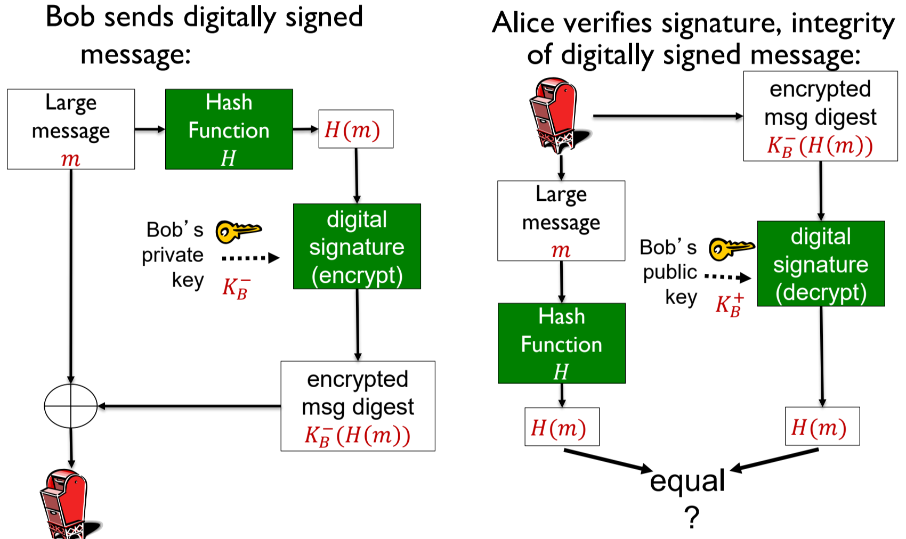
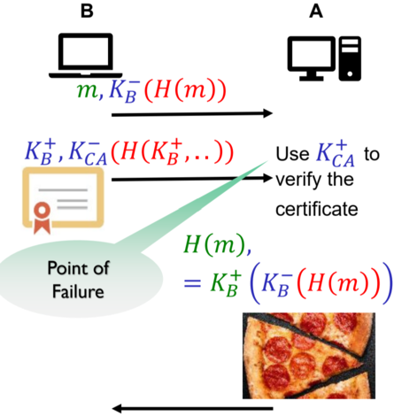

## A. Motivation
- trying to communicate securely over an insecure channel
	- have no mechanism of preventing interception and modification of data

- we want to send a secret message (others who are unauthorized should not be able to make sense of it)
## B. Message Integrity
- we want to be able to detect any alteration of the message (usually by the recipient)
- ensure that any alteration of our message should be caught
	- we have seen this requirement earlier in `rdt` protocols used to ensure the reliability of the UDP transport layer protocol (error detection using checksum)
	- using other similar error detection mechanisms like **CRC** and **parity bits** to determine the validity of the data
### Hashing & Hash Functions
> A hash function takes in an input $m$ and produces a **fixed-size message digest** (a.k.a. a fingerprint)
 $$
m \xrightarrow{\text{  }H(.) \text{  }} H(m) 
$$
- Note that the Hash function is denoted as $H(.)$
##### Properties
- is a **many-to-one function** (although we want to reduce this as much as possible, to reduce # hash collisions)
- probably has collision (an inadvertent result)
- provides data compression (i.e. can ID some longer string of text just using the hash function)

- any small change input should result in a large change in the output
	- the hash value computed is drastically different and not even close to each other

- is a **one way function**
	- only purpose is to ensure that data has not being modified

- deterministic, but seemingly random
	- hashing the same input will produce the same output
	- encrypting the same output will produce different ciphertexts each time
##### Functions and use cases
- used for verifying the **authenticity of software downloads**
	- corruption or integrity compromised is detected

- hash of the malwares (**IoCs**)

- **storing of passwords** (hash of password is stored on the DB)
	- possibly with salt stored on it
	- passwords are never matched (since only the hash is stored and it is not reversible) and the user is only allowed access when the hashes match (computed and one stored in the users table in the DB)

- **timestamping**
	- used as a proof of work without revealing the actual work itself
	- submitting the hash of work produces a timestamp of submission for further verification
	- ensure that the hashes match in the end to prove no modification made after the time

- **Blockchain** (Distributed Ledgers)
	- checking data integrity in blockchains
##### Examples
1. **Internet Checksum**
	- produces a fixed length message digest (of length $16$-bits)
	- is a many-to-one function and probably will have collisions
	- typically used in the transport and network layers

	- presence of collision depends on checksum algorithm
		- may have collisions if we just use ASCII values as the checksum

	- checksums are able to detect errors, but **not attacks** (easy to find another message with the same checksum value)
		- if anyone is motivated to conduct attack on Integrity, cannot detect this
			
	
2. **Cyclic Redundancy Check**
	- somewhat better than Checksum, but is still bad
	- output is biased towards the input
		- small changes in the input would produce minor changes in the output

	- still cannot use it to detect the attack (motivated change of our message)

3. **Cryptographic Hash Functions**
	- is a hash function that is **computationally infeasible** any two different input messages with the same message digest as the input
		- $x, y$ s.t. $H(x) \neq H(y)$ is the **ideal scenario** (except for MD5 and SHA1 😅)

	- computationally infeasible for intruder to substitute one message for another (sufficiently dispersed in the hash space)

	- MD5 which is widely used and generates $128$-bit message digest (16 bytes or 32 hex digits)
		- inputs of size $x, y, z$ but output of constant size $16$-bytes 
	- SHA-1 which uses $160$-bit message digest (20 bytes or 40 hex digits)

	- SHA-2 and SHA-3 are the current cryptographic standards (to replace the deprecated MD5 and SHA-1)
##### Ensuring message integrity
- we *could send* data $+$ hash of the data so it can be verified, i.e. $(m, H(m))$
- the hash function is public, there is no hidden components
- attacker can possibly intercept and replace $(m, H(m))$ with $(e, H(e))$ and send it on its way
	- receiver has **no way** of detecting it $\implies$ this is a problem to integrity and authenticity of the message
##### Advantage of using hashing
- unlike encryption it is faster and library code for hashing is widely available on computers
- US used to restrict exports of encryption algorithms
### Message Authentication Code (MAC)
- ensure that the sender and receiver **share authentication keys**
- used in combination with hashing
- should instead send $(m, H(m + s))$ to verify the sender
	- message is concatenated to shared key $s$ and then the whole thing is hashed
	- it works because $s$ is a secret known to only the sender and receiver and no one else (serves as a form of authn)
		- receiver can generate $s$ as well directly from the plaintext message $m$ and compare it with he received code
		
	- the concatenation operation could indicate that the message $m$ **has been modified using the shared authn key** $s$ (i.e. it is *not necessarily addition*)

$$
\begin{aligned}
&\textbf{Generating the MAC code using } s \\
&m \xrightarrow{\text{ concat } \textbf{s }} \: (m + s) \: \xrightarrow{\text{ }H(.)\text{ }} H(m + s) \\\\
& \textbf{Send the tuple } (m, H(m + s)) \textbf{ over in secure channel.} \\\\
&\textbf{Recipient checks digests}\\
&1. \text{ Separate } H(m + s) \text{  from } m \\
&2. \text{ Compute the MAC again: } \: m \xrightarrow{\text{ concat } \textbf{s }} \: (m + s) \: \xrightarrow{\text{ }H(.)\text{ }} H(m + s) \\
&3.  \text{ Check if } H(m + s) = H(m + s)
\end{aligned}
$$

- has a **problem** of exchanging the authn key $s \implies$ similar problem to symmetric encryption (could use PKI to solve this problem of key distribution)
	- PKI can also solve the problem of $s$ being compromised

## C. Authentication
- prove that you are who you claim to be (confirm the identity)
- used to use handwritten signatures
- cannot fully be solves as it relies greatly on trusting the CAs as well
### Digital Signatures
- are a cryptographic technique analogous to hand-written signatures
- each sender party digitally signs the documents and establishes that they are the creator or owner of a particular file or document
- use RSA as the technology for verification and unforgeability of digital signatures (invert operation and yet have the same output)
##### Properties
- should be **verifiable** (can check that it was indeed the sender who generated it)
- should be **unforgeable** (no one except the sender can generate the *signature and the message*)

- ensure **message integrity**  (we ensure that what the sender sends is not modified) $\implies$ comparing the message in its original form and the decrypted message which has been guaranteed to not be modified
- ensures **non-repudiation** (sender cannot deny having created the message since it was signed by sender's private key is presumed to be only with the sender, not duplicatable)
- satisfies **authentication** (authenticity of the sender)
##### How it works - Trivially
Message is sent from **Bob to Alice**
1. Sender signs $m$ by encrypting the message using private key $K_B^-$ to create the signature or "ciphertext" $K_B^-(m)$
	- we switch the role of public and private key in PKI where we are using the sender's private key for encryption in DS instead of using the recipient's public key in PKI

2. Sender sends the tuple $(m, K_B^-(m))$

3. Recipient uses $K_B^+$ to decrypt and extract $m$, since $K_B^+(K_B^-(m)) = m$
	- assumes that recipient will have the sender's public key
	- we are **not trying to achieve confidentiality** with digital signatures, but rather, **authentication** of the sender
	- should work as only Bob should have his private key theoretically  (no one should be able to recreate the private key of the sender $K_B^-$ ) $\implies$ ties in with the non-repudiation property, when recipient can take $(m, K_B^-(m))$ and verify that the sender is Bob

$$
\begin{aligned}
&\textbf{Obtaining the digitally signed message: }\\
&m \xrightarrow{\text{ }K_B^-\text{ (for encryption)}} K_B^-(m) \\\\
&\textbf{Send to recipient: } \\
& \text{The tuple: } (m, K_B^-(m)) \\\\
&\textbf{Verifying the signature of the message} \\
& 1. \text{ Extract the message digest }\quad K_B^-(m) \xrightarrow{\text{ }K_B^+\text{ (for decryption)}} K_B^+(K_B^-(m)) \equiv m \\
& 2. \text{ Verify the consistency of the two \textbf{messages}.  i.e. Is } m = m\text{?}
\end{aligned}
$$
##### Optimization
- optimization can be made for an **extremely large message** $m$ to generate the message digest because asymmetric crypto (RSA) is ***computationally expensive***
	- can instead sign the hash of the message with the private key to obtain the digital signature (reduces the need to spend lots of resources to encrypt and decrypt the standalone $m$)
	- we compare the **hashes** instead of the message body themselves

- makes the signing and transfer process much more efficient as well
	- resource the overhead required to transmit the resources (tuple)

- does not fulfil confidentiality inherently because the message itself is not encrypted

$$
\begin{aligned}
&\textbf{Obtaining the digitally signed message: }\\
&m \xrightarrow{\text{ }H(.)\text{ }}H(m) \xrightarrow{\text{ }K_B^-\text{ (for encryption)}} K_B^-(H(m)) \\\\
&\textbf{Send to recipient: } \\
& \text{The tuple: } (m, K_B^-(H(m))) \\\\
&\textbf{Verifying the signature \& integrity of the message} \\
& 1.\text{ Perform hash function on received message.} \quad m \xrightarrow{\text{ }H(.)\text{ }}H(m) \\
& 2. \text{ Extract the message digest }\quad K_B^-(H(m)) \xrightarrow{\text{ }K_B^+\text{ (for decryption)}} K_B^+(K_B^-(H(m))) \equiv H(m) \\
& 3. \text{ Verify the consistency of the two \textbf{hash digests}.  i.e. Is } H(m) = H(m) \text{?}
\end{aligned}
$$

### Using MAC as an alternative
**Similarities**
- from a utility standpoint, they essentially offer a **similar** function or service (not exactly the same)
- in both cases, the signature and the message is the same $\implies$ no modification without detection

**Differences**
- the shared MAC code $s$ needs to be exchanged
- **Non-repudiation property:** Alice can create a message supposedly from Bob and claim that Bob sent is (since the shared key $s$ is symmetric in nature) $\implies$ cannot do this when using PK encryption because of the non-repudiation
	- ⚠️ we can confirm who send the message by using digital signature versus MAC (its main purpose) $\implies$ to be used in a court of law

- MAC is usually used within a shared community where things are more controlled while Digital Signatures are used externally as well

- MAC is way **cheaper** and computationally less expensive as compared to using Digital Signatures

- Digital Signatures are use for usage in the public domain for verification of Integrity as well

## D. Weaknesses of Public Key Encryption
- when we use Digital Signatures alone, Confidentiality is not considered as much
	- change the message from "4 pizzas" to "5 pizzas"

- need to ensure that the **public key** is **distributed securely**
	- no one in the channel can intercept and replace the public key 
	- how to publicize the public key
		- public announcement (on a website)
		- available in a publicly available directory
		- usage of Public Key Infrastructure
## E. Public Key Infrastructure (PKI)
- trying to solve the problem of key distribution in such a way that **no one can claim** that they own a public key **other than the owner**
	- $K^+$ belongs to the sender but $K^{+'}$ does not belong to the sender
	- prevent public key forgery (the public key itself could be compromised) $\implies K_B^+$ is a point of failure
### Certificates & Certification Authority
> A **certificate** is a ==digital document or file== that contains at least the following items: 
> - **identity** of the owner (info about the entity holding the certificate)
> - **public key** of the owner
> - **signature** of the **CA** approving the certificate (chain of hierarchy)
> - time window in which cert is valid

- The CA is a company or organization which:
	- **issues and signs** Digital Certificates to websites
	- maintains a **directory of public keys**
	- ensures that its own public-private key pair is securely distributed to all entities

- Intermediate step of using **CA's public key** to **verify** the validity of **sender's public key**, use sender's public key to extract the message digest in the digital signature
	- no cert modification
	- can be sure that the sender's public key can only be from the sender himself

- possibility of the CA to be compromised
	- bribed or intimidated to generate a certificate (more so the case for the trusted root CAs)
	- make oneself a fake CA $\implies$ generate unnecessary vulns

**Initial Problem**:
- did not know sender's public key (or more so, how to trust that the legitimacy of sender's public key)

**Solution to initial Problem, Next Problem**
- create a Certification Authority who certifies everyone's public key
- Anyone who receives a message from Bob will verify the cert using CA's pub key and extract $K_B^+$

- Problem becomes: did not know the CA's public key

**Solution to Next problem**
- create another CA that verifies the other CAs (i.e. root CAs)
- Another Problem becomes: ...
	- CAs are so public that everyone trusts them (universal knowledge)
	- routers and OS has a list of Trusted Root CAs
##### Properties of CAs
- binds the public key created to a particular entity $E$.
- $E$ registers their public key with the CA (provides "proof of identity" in this process)
	- CA creates a certificate binding $E$ to the public key, for a set period(certs can expire)

$$
\begin{aligned}
\textbf{Making the certificate's  digest: }& \quad \text{Cert}_B = K^-_{CA}(H(K_B^+ + \ldots)) \\\\
\textbf{Obtaining } \mathbf{K_B^+} \textbf{'s digest  from cert: }& \quad K_B^+ = K_{CA}^+(\text{Cert}) = K_{CA}^+(K^-_{CA}(H(K_B^+))) \\\\
\text{We can hash the } K_B^+ &\text{ attached to verify the legitimacy of it.}
\end{aligned}
$$

- Any party $F$ who wants to communicate with $E$ would just need the certificate file to establish **secure communications**
	- don't even need Internet connection

	
##### Use Cases
- Singpass is used to sign documents (placing order etc.)
- DocuSign

Note: When combining symmetric and public key crypto, we **cannot use** sender's private key for encryption, lest the **symmetric key $\mathbf{K_S}$ will be compromised**
- we use Bob's public key encrypt $K_S$ so that only he can decrypt it

---
## F. Availability -- Operational Network Security through Firewalls
- Availability $\to$ services are always available for access (no DoS attacks)
	- bare minimum is to have firewalls

> A **firewall** is a device or software that isolates the organization's internal network from the larger Internet by allowing some packets to pass while blocking others.
- form of **access control** (access restriction of devices on the Internet from the LAN)
	- follows the guiding principle that we should not trust anything from the Internet (default to the label of bad guy until proven otherwise)
- used for access and availability aspects of cyber security
- has two slides, administered network as well as the public facing Internet
### Functions
- required to prevent denial of service attacks (want to prevent any such attempts)
	- i.e. *SYN flooding* whereby attacker establishes **many bogus TCP connections** (could be request or queries)
	- **denies** legitimate users to **access** the service, since there are no more resources left for these "real" connections

- preventing illegal **modification or access** of Internal data to unauthorized users
	- preventing leaked credentials to a certain extent

- acts as the first layer of defence in a network
	- can be installed on the default gateway / last hop router within the LAN

- need to allow **only authorized access** to inside the network
	- involves authentication of actual users
	- seamless access for users to resources within the network and controlled access to resources outside (i.e. from the Internet)
### Types
#### 1. Stateless Packet Filters
- control of ingress and egress traffic to and from the internal company network that it protects
- sits in the middle and acts as a proxy (or gateway)
- filters **each packet** according to pre-set rules (packet-level filtering)
	- drop / fwd based on 
		- `src_ip`, `dst_ip` , source and destination `port` numbers
		- TCP or UDP protocols or 
		- ICMP message type (allow limited probing into network)
		- packets with allowed TCP flags $\implies$ IP and network layer details only

- Some implementation examples
	- **block all ingress and egress** datagrams with IP `proto` = `17`
		- all incoming and outgoing UDP flows are blocked (all UDP connections will be affected)
		

	- block all **inbound TCP segments** with **ACK= `0`**
		- prevents external hosts from making inbound TCP connections, but assumed to allow internal connections to external hosts (provided there is no such rule blocking it)
		- don't want a TCP server to be hosted inside the network that can be access from the Internet

- possible to **configure firewall-specific** **implementation** based on company's firewall policy
	- No outside web access: `drop 192.168.1.*/24 any -> any 80/tcp, 443/tcp`
	- No incoming TCP connections except for those to web server:  `allow any any  -> 137.207.244.203 80/tcp ; drop any any -> any any` (have to restrict to **TCP SYN packets** as well)

	- Prevent web-radios from eating up network bandwidth (drop all incoming UDP packets except for DNS and router broadcasts)
		- deny or restrict access to deprecated technologies that can be misused by attackers

	- Prevent network from being used for a DoS attack: drop all ICMP packets going to a *broadcast address* (i.e. `X.Y.Z.255`)
		- filtering of packets at the firewall level can help to prevent such an attack

	- Prevent network from being tracerouted by dropping all outgoing **ICMP TTL expired** traffic
		- don't want to enable people to map network topology
		- property of traceroute packets is the ICMP TTL expired ones (each time the TTL will be incremented by one when sending the packet)

- can make use of restrictions based on the fields in the network and transport layer to create the rules (i.e. the IP and TCP/UDP properties)
	- become a set of `if... then...` conditions (if, else if branching type)
	- the `else` condition should default to `deny all all ...` (default catch-all)

- An access control list is a table of rules, applied from top to bottom (sequentially) on incoming packets

==**Limitations**==
Firewall is one of the components of network security of an organization and is not 100% foolproof
1. Cannot prevent IP spoofing: firewall has no way of knowing the IP address in the packet are actual genuine and not spoofed
2. Can become a bottleneck because it is the single point of entry into LAN
	- should have multiple firewalls for load balancing $\implies$ costly

3. Trade off between the degree of communication with the WAN / Internet
	- need to determine the level of security required for each machine (and classify them as required)
	- sensitive computers should be in **air-gapped networks** that are not connected to the Internet whatsoever (missile systems, CII and weapon controller machines)

4. many highly protected sites (using firewalls and other defences can still suffer from attacks)
	- having many firewall rules does not equate to having better security $\implies$ security should be evaluated and revised frequently (**false sense of security**)

5. Does not stop insider threat and internal attacks
#### 2. Stateful Packet Filters
(2) and (3) are not covered in detail
#### 3. Application Gateway (application / layer 7)