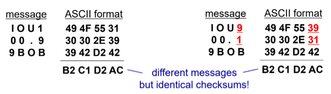
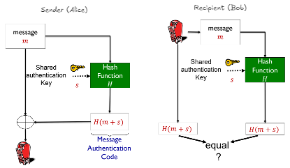
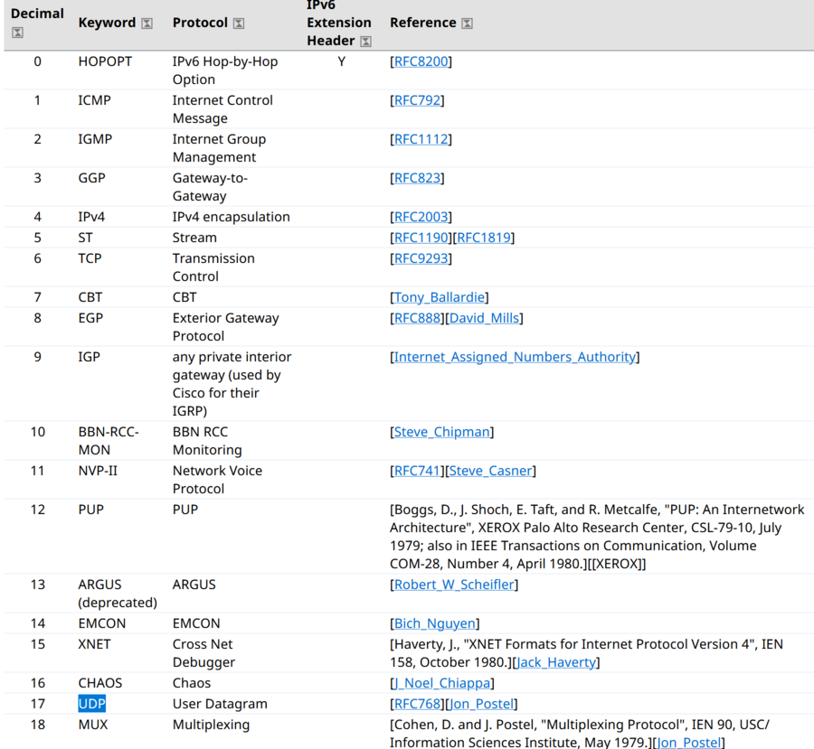

## A. Motivation
- trying to communicate securely over an insecure channel
	- have no mechanism of preventing interception and modification of data

- we want to send a secret message (others who are unauthorized should not be able to make sense of it)
## B. Message Integrity
- we want to be able to detect any alteration of the message (usually by the recipient)
- ensure that any alteration of our message should be caught
	- we have seen this requirement earlier in `rdt` protocols used to ensure the reliability of the UDP transport layer protocol (error detection using checksum)
	- using other similar error detection mechanisms like **CRC** and **parity bits** to determine the validity of the data
### Hashing & Hash Functions
> A hash function takes in an input $m$ and produces a **fixed-size message digest** (a.k.a. a fingerprint)
 $$
m \xrightarrow{\text{  }H(.) \text{  }} H(m) 
$$
- Note that the Hash function is denoted as $H(.)$
##### Properties
- is a **many-to-one function** (although we want to reduce this as much as possible, to reduce # hash collisions)
- probably has collision (an inadvertent result)
- provides data compression (i.e. can ID some longer string of text just using the hash function)

- any small change input should result in a large change in the output
	- the hash value computed is drastically different and not even close to each other

- is a **one way function**
	- only purpose is to ensure that data has not being modified

- deterministic, but seemingly random
	- hashing the same input will produce the same output
	- encrypting the same output will produce different ciphertexts each time
##### Functions
- used for verifying the **authenticity of software downloads**
	- corruption or integrity compromised is detected

- hash of the malwares (**IoCs**)

- **storing of passwords** (hash of password is stored on the DB)
	- possibly with salt stored on it
	- passwords are never matched (since only the hash is stored and it is not reversible)

- **timestamping**
	- used as a proof of work without revealing the actual work itself
	- submitting the hash of work produces a timestamp of submission for further verification
	- ensure that the hashes match in the end to prove no modification made after the time

- **Blockchain** (Distributed Ledgers)
	- checking data integrity in blockchains
##### Examples
1. **Internet Checksum**
	- produces a fixed length message digest (of length $16$-bits)
	- is a many-to-one function and probably will have collisions
	- typically used in the transport and network layers

	- presence of collision depends on checksum algorithm
		- may have collisions if we just use ASCII values as the checksum

	- checksums are able to detect errors, but **not attacks** (easy to find another message with the same checksum value)
		- if anyone is motivated to conduct attack on Integrity, cannot detect this
			
	
2. **Cyclic Redundancy Check**
	- somewhat better than Checksum, but is still bad
	- output is biased towards the input
		- small changes in the input would produce minor changes in the output

	- still cannot use it to detect the attack (motivated change of our message)

3. **Cryptographic Hash Functions**
	- is a hash function that is **computationally infeasible** any two different input messages with the same message digest as the input
		- $x, y$ s.t. $H(x) \neq H(y)$ is the **ideal scenario** (except for MD5 and SHA1 😅)

	- computationally infeasible for intruder to substitute one message for another (sufficiently dispersed in the hash space)

	- MD5 which is widely used and generates $128$-bit message digest (16 bytes or 32 hex digits)
		- inputs of size $x, y, z$ but output of constant size $16$-bytes 
	- SHA-1 which uses $160$-bit message digest (20 bytes or 40 hex digits)

	- SHA-2 and SHA-3 are the current cryptographic standards (to replace the deprecated MD5 and SHA-1)
##### Ensuring message integrity
- we *could send* data $+$ hash of the data so it can be verified, i.e. $(m, H(m))$
- the hash function is public, there is no hidden components
- attacker can possibly intercept and replace $(m, H(m))$ with $(e, H(e))$ and send it on its way
	- receiver has **no way** of detecting it $\implies$ this is a problem to integrity and authenticity of the message
##### Advantage of using hashing
- unlike encryption it is faster and library code for hashing is widely available on computers
- US used to restrict exports of encryption algorithms
### Message Authentication Code (MAC)
- ensure that the sender and receiver share authentication keys
- used in combination with hashing
- should instead send $(m, H(m + s))$ to verify the sender
	- message is concatenated to auth code $s$ and then the whole thing is hashed
	- it works because $s$ is a secret known to only the sender and receiver and no one else (serves as a form of authn)
		- receiver can generate $s$ as well directly from the plaintext message $m$ and compare it with he received code
		
	- the concatenation operation could indicate that the message $m$ has been modified using the authn key $s$ (id not necessarily addition)

- has a problem of exchanging the authn key $s \implies$ similar problem to symmetric encryption (could use PKI to solve this problem of key distribution)
	- PKI can also solve the problem of $s$ being compromised

## C. Authentication
- prove that you are who you claim to be (confirm the identity)
- used to use handwritten signatures
### Digital Signatures
- are a cryptographic technique analogous to hand-written signatures
- each sender party digitally signs the documents and establishes that they are the creator or owner of a particular file or document
- use RSA as the technology for verification and unforgeability of digital signatures (invert operation and yet have the same output)
##### Properties
- should be **verifiable** (can check that it was indeed the sender who generated it)
- should be **unforgeable** (no one except the sender can generate the *signature and the message*)

---
## D. Availability -- Operational Network Security through Firewalls
> A **firewall** is a device or software that isolates the organization's internal network from the larger Internet by allowing some packets to pass while blocking others.
- form of **access control** (access restriction of devices on the Internet from the LAN)
	- follows the guiding principle that we should not trust anything from the Internet (default to the label of bad guy until proven otherwise)
- used for access and availability aspects of cyber security
- has two slides, administered network as well as the public facing Internet
### Functions
- required to prevent denial of service attacks (want to prevent any such attempts)
	- i.e. *SYN flooding* whereby attacker establishes **many bogus TCP connections** (could be request or queries)
	- **denies** legitimate users to **access** the service, since there are no more resources left for these "real" connections

- preventing illegal **modification or access** of Internal data to unauthorized users
	- preventing leaked credentials to a certain extent

- acts as the first layer of defence in a network
	- can be installed on the default gateway / last hop router within the LAN

- need to allow **only authorized access** to inside the network
	- involves authentication of actual users
	- seamless access for users to resources within the network and controlled access to resources outside (i.e. from the Internet)
### Types
#### 1. Stateless Packet Filters
- control of ingress and egress traffic to and from the internal company network that it protects
- sits in the middle and acts as a proxy (or gateway)
- filters **each packet** according to pre-set rules (packet-level filtering)
	- drop / fwd based on 
		- `src_ip`, `dst_ip` , source and destination `port` numbers
		- TCP or UDP protocols or 
		- ICMP message type (allow limited probing into network)
		- packets with allowed TCP flags $\implies$ IP and network layer details only

- Some implementation examples
	- **block all ingress and egress** datagrams with IP `proto` = `17`
		- all incoming and outgoing UDP flows are blocked (all UDP connections will be affected)
		

	- block all **inbound TCP segments** with **ACK= `0`**
		- prevents external hosts from making inbound TCP connections, but assumed to allow internal connections to external hosts (provided there is no such rule blocking it)
		- don't want a TCP server to be hosted inside the network that can be access from the Internet

- possible to **configure firewall-specific** **implementation** based on company's firewall policy
	- No outside web access: `drop 192.168.1.*/24 any -> any 80/tcp, 443/tcp`
	- No incoming TCP connections except for those to web server:  `allow any any  -> 137.207.244.203 80/tcp ; drop any any -> any any` (have to restrict to **TCP SYN packets** as well)

	- Prevent web-radios from eating up network bandwidth (drop all incoming UDP packets except for DNS and router broadcasts)
		- deny or restrict access to deprecated technologies that can be misused by attackers

	- Prevent network from being used for a DoS attack: drop all ICMP packets going to a *broadcast address* (i.e. `X.Y.Z.255`)
		- filtering of packets at the firewall level can help to prevent such an attack

	- Prevent network from being tracerouted by dropping all outgoing **ICMP TTL expired** traffic
		- don't want to enable people to map network topology
		- property of traceroute packets is the ICMP TTL expired ones (each time the TTL will be incremented by one when sending the packet)

- can make use of restrictions based on the fields in the network and transport layer to create the rules (i.e. the IP and TCP/UDP properties)
	- become a set of `if... then...` conditions (if, else if branching type)
	- the `else` condition should default to `deny all all ...` (default catch-all)

- An access control list is a table of rules, applied from top to bottom (sequentially) on incoming packets

==**Limitations**==
Firewall is one of the components of network security of an organization and is not 100% foolproof
1. Cannot prevent IP spoofing: firewall has no way of knowing the IP address in the packet are actual genuine and not spoofed
2. Can become a bottleneck because it is the single point of entry into LAN
	- should have multiple firewalls for load balancing $\implies$ costly

3. Trade off between the degree of communication with the WAN / Internet
	- need to determine the level of security required for each machine (and classify them as required)
	- sensitive computers should be in **air-gapped networks** that are not connected to the Internet whatsoever (missile systems, CII and weapon controller machines)

4. many highly protected sites (using firewalls and other defences can still suffer from attacks)
	- having many firewall rules does not equate to having better security $\implies$ security should be evaluated and revised frequently (**false sense of security**)

5. Does not stop insider threat and internal attacks
#### 2. Stateful Packet Filters
(2) and (3) are not covered in detail
#### 3. Application Gateway (application / layer 7)