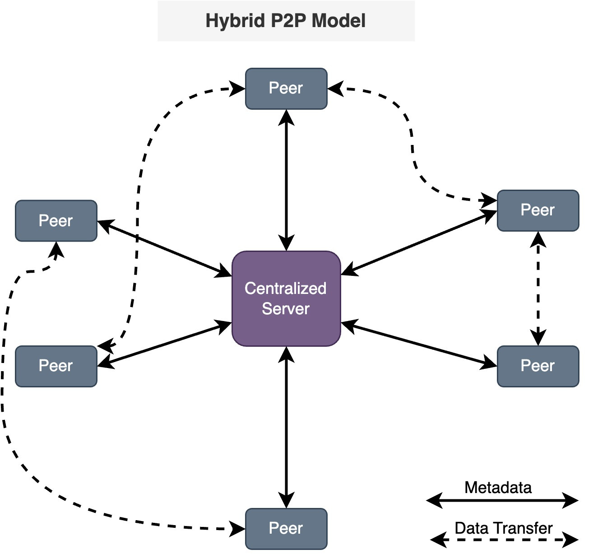
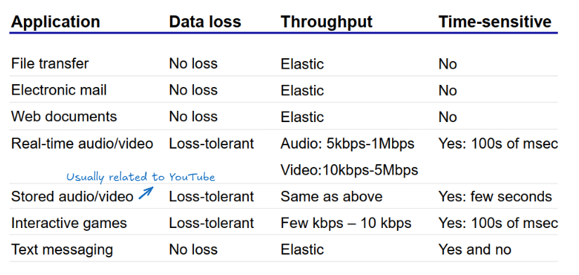

## 1.x Recap: Packet Switching
- Router uses store and forward technique to perform packet switching
- Is message is bigger than the size of 1 packet, then it is broken up and contained in multiple packets

**Packet delay**
	- Processing Delay  - router process what to do with the packet
	- Queueing Delay
	- Transmission Delay - time taken to travel over physical media (measured in one bit)
	- Propagation Delay

 **Protocols**
 - many services using the Internet (i.e. Zoom calls, emails)
 - exist to define how messages should be exchanged
 - define the format and order of message exchanged

Using the 5 layer TCP/IP Model
- Weeks 1 to 5: Application and Transport
- Weeks 6 to 10: Network and Link 

## 2.0 Evolution of Network Applications
- Early days of the Internet: using Telnet (old version of SSH)
- CPU is shared by different people, access through dumb terminals
- Now, CPU and bandwidth is cheap $\implies$ application go from on-prem to cloud
## 2.1 Principles of Network Applications
- application layer protocol used by every single Internet Application
- network applications run on hosts or endpoints and contain communicating processes
	- a **host** is any device that *has an IP address* (is addressable, can find you)
### Application Architectures
- process is used quite loosely (can be either described as a client process or a server process)
#### 1. Client-Server Model
- has a server process that waits to be contacted (through incoming requests)
- also has a client process that initiates the connection with the server
	- typically requests for a particular service (i.e. file resource, file download, data etc.)
	- for web usage (using `http` and `https` protocols), the client is usually implemented with the use of a browser
#### 2. Peer-to-Peer (P2P)
- No such this as always on (has downtime in consideration)
- arbitrary endpoints directly communicate with each other
- each endpoint (a peer) requests for services, which are provided by other peers (i.e. peers are classified on the similar level)
- not covered in detail in CS2105 (loss of relevancy)

**Advantage**
- Highly scalable

**Disadvantage**
- ==Difficult to manage (?)==

####  3. Hybrid
- uses a combination of client-server and P2P model
- i.e., using a chatting service between two users

- presence detection or location is centralized
	- each user or endpoint first registers their IP address with a central server when they are first online
	- user contacts the central server to find IP address of targets they wish to communicate with, that are within the scope of the hybrid network.

## 2.1a Network Transport and Protocols
#### Key Question: What (kind of) transport service does an app need?
- i.e. the factors to consider when selecting a transport service, what kind of the service to be rendered?
- usually the first three of these points are the most important (?)

**Ensuring Data Integrity**
- for every single byte sent out, need to receive everything
- some applications may require 100% reliable data transfers (i.e. no breakage in the connection)
- other applications like audio streaming might be able to tolerate some data loss, JPEG lossy

**Ensuring Throughput**
- multimedia apps might require minimum amount of bandwidth to function normally
- on the other hand, file transfer application makes use of whatever throughput is available
- throughput: the average data rate per second
- Elastic $=$ low bandwidth can be tolerated

**Time Sensitivity (Delay)**
- some apps like online interactive games are sensitive to delay (low vs high latency)

**Security**
- Encryption of traffic and packets, data integrity and authentication.

#### Things that protocols define
1. The types of messages exchanged (i.e. request, responses)
2. Rules of the protocol (when and how application send and respond to messages)
3. Message Syntax (fields, how fields are delineated or what bytes make up what)
4. Message Semantics (meaning of the information in fields)
5. Open protocols (defined through RFCs, allow for interoperability) versus Proprietary Protocols (i.e. Lightning from Apple, Skype)

### Process of delivery
**Key Questions:** 
- How do we identify the recipient?
	- Globally Unique Address (i.e. the host) $\implies$ **no ambiguity**
- How do we get the message over to the correct recipient in the house (i.e. NAS in a certain house communicating over a certain protocol)? 
	- Locally Unique Process Name / Port Number (with mapping to the processes)
		- 16-bit number: $0$ to $65535$
		- can have reserved or standardised (but not recognised by IANA)

What kind of services?
- Tracking, Reliability, Receipt?

What service provide and what can it not provide?
- tracking service
- receipts
### Sockets
- socket is how we interface from the application with the transport layer $\implies$ open a calling line

### Transport Protocol
- TCP, UDP, QUIC (not universal yet)
	- TCP is connection-oriented, flow-controlled, congestion controlled (prevent from sending too much) and reliable
		-  takes some time to connect
		
	- UDP is connectionless, no control, not reliable
		- don't have reliability, no flow control, no congestion control, no throughput guarantee and security
		
	- QUIC is a third service available to OS and applications

## 2.2 Web and HTTP
- computers need some way of understanding each other
	- through ASCII ($0$ to $127$) and UTF-8, the standard of communication

- WWW runs over the Internet
	- Bulleting Board (like a forum, runs on a credit system)
	- HTML (allows linking to other documents and resources)
	- URLs explain how to locate other resources
		- components: `hostname` and then `path`
		- web server configured to return default object if `path` not specified

	- HTTP explains how to access those resources, used previously for accessing HTML resources
	
- WWW Consortium: global open standards

### HTTP
- Using a client-server model, the protocol for requesting and receiving web resources
- Transport Layer Setup, Application Level Continuation

- Round Trip Time: need to incur at least 2 RTTs
	- connection setup
	- getting the resource

- HTTP/1.1 
	- is persistent: use the same TCP connection to retrieve multiple resources from the same server
	- request for HTML files and the embedded image files
	- Can be pipelined: no longer have to wait 1 RTT for each resource (request all $x$ images at once)
	- server responds with resources sequentially

- HTTP/2
	- enables for multiplexing $\implies$ pipelining still takes place, but request can be broken up and not returned in sequential order
		- partial resources can be provided as well

- HTTP/3 (uses QUIC/UDP)
	- allows the QUIC application to handle packet losses
	- removes TCP's head-of-line blocking

### HTTP Request
- is usually just a text request
- end of line character is `\r\n`
	- carriage return-line feed

- ends with two lines

### HTTP Response
- contains header and binary payload
### Plain Text (ASCII) versus Binary
- Binary format compacts everything (compact headers to save space)
- Plain Text is for legacy purposes