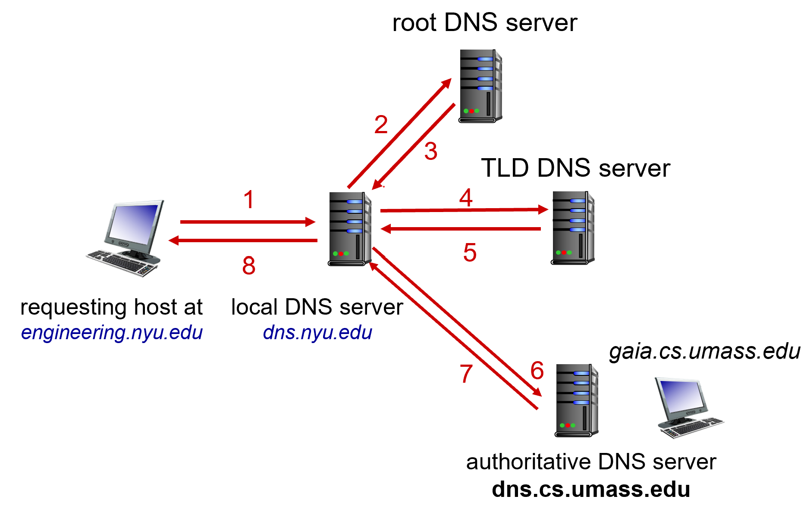
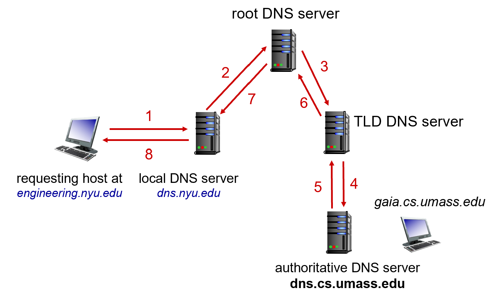

## A. Recap from L2
- WWW is made up on multiple servers
- webpage consists of a base html file $\implies$ tells how to render page and the resources to be included

- we use HTTP to request webpages, which in turn uses TCP
	- for this course, assume HTTP uses TCP (exclude QUIC/UDP)

HTTP Versions
- HTTP/1.0 $\implies$ per request setup for each connection
- HTTP/1.1 $\implies$ multiple requests per single connection, has pipelining
	- concept of pipelining versus sequential


- HTTP/2 allows for multiplexing
	- response can come back in any order, even partially
	- don't have to learn about the mechanics of HTTP/2.0 (only 1.1 and below)

- TCP is a reliable transport protocol

### HTTP Request
- Not very possible to manually send HTTP request from the command line.
	- $2 \times$`\r\n` comes **after** the end of the HTTP Request header.

```
GET /~CS2105/demo.html HTTP/1.1\r\n
Host: www.comp.nus.edu.sg\r\n
User-Agent: Mozilla/5.0\r\n
Connection: close\r\n
\r\n
```

```
method <sp> path <sp> version\r\n
header_field: <sp> value\r\n
...
header_field: <sp> value\r\n
\r\n
```

### HTTP Response
- first line will be the http version and the status code with the status message.
	- the status message is the human-readable description to the code
	- should know the general HTTP Status Codes (i.e. `200`, `301`, `304`, `403`, `404`, `500`)
		- `301` Move Permanently $\implies$ browser does the redirect
		- `304` If the resource was modified since it was last cached.
		- `404` Not found $\implies$ technically do not need to give any data, but can be configured on webserver to return default Not Found page

```
version <sp> response_code
date: value\r\n
server: value\r\n
...
Content-Length: <value>\r\n
Content-Length: <value>\r\n
Keep-Alive: timeout=5, max=100\r\n
\r\n
<html code>
```

### Cookies
- HTTP was designed to be stateless (no session to remember)
	- Cookie are used to maintain state $\implies$ some piece of data which the browser stores
	- webserver provides a cookie to the client, which is meant to be kept secret
		- cookies or session ID should be kept secret to individual users
		- cookies can be used to track end-hosts as well
		
	- there is minimal security implemented in cookies

### Caching Web Resources
- browser can cache resources to speed up displaying of pages $\implies$ no need to keep downloading resources if nothing has changed (i.e. HTML, CSS, JS Scripts)
	- returning `304` not modified

---
## B. Domain Name System (DNS)
- hosts are addressed by their IP address, but we don't usually type IP addresses in web browsers (or do we?)
- DNS allows for a **mapping** from the URL to the actual host $\implies$ translates the hostname to an IP address, hosts are identified by IP addresses
	- allows for host aliasing where we can have canonical and alias names
- is a **distributed database** implemented in a hierarchy of many
- is an application layer protocol, where hosts and DNS servers communicate to resolve domain names
- can be used for load distribution as well where we have many replicated web servers and Ip addresses to one particular hostname
	- DoS and DDoS mitigation

- DNS is distributed 
	- no Single Point of failure
	- good for maintenance (still can perform DNS queries)
	- physical decentralization

- required for the proper functioning of the Internet
### DNS Resource Record
There are a few resources stored on a domain
1. `A` or `AAAA` $\implies$ the hostname
	- Multiple `A` records are meant for load balancing reasons
	- world wide web to access the web server

2. `MX` $\implies$ mail
	- the SMTP protocol uses the `MX` record to find the corresponding mail server

3. `NS` $\implies$ name server 
	- hostname for the authoritative name server in the specified domain

4. `CNAME` $\implies$ canonical name: an alias for the real domain

```
nslookup -type=any mail.google.com
Server:  resolver8.nus.edu.sg
Address:  172.19.50.39

Non-authoritative answer:
mail.google.com AAAA IPv6 address = 2404:6800:4003:c11::53
mail.google.com AAAA IPv6 address = 2404:6800:4003:c11::13
mail.google.com AAAA IPv6 address = 2404:6800:4003:c11::12
mail.google.com AAAA IPv6 address = 2404:6800:4003:c11::11
mail.google.com internet address = 172.217.194.19
mail.google.com internet address = 172.217.194.83
mail.google.com internet address = 172.217.194.17
mail.google.com internet address = 172.217.194.18
```

- DNS Record are stored in a hierarchical structure of different DNS Servers
	- a distributed, hierarchical database
	- The *Hierarchy*: Root $\to$ TLDs $\to$ Authoritative Servers
		- TLD servers are responsible for `.com`, `.org`, `.net`, `.edu` etc. and country domains
		- Authoritative (DNS) Servers are the *organization's* own DNS servers that provide authoritative hostname to IP mappings for the host known to the organization.
			- manages domains below them
			- can also be maintained by ISPs

	- Local DNS Server
		- does not belong to the hierarchy of DNS servers
		- sits on the local network (i.e. university campus network, company, residential ISPs)
			- a.k.a. default name server
		- obeys the keep-alive for the DNS record

		- any DNS queries made are sent to the local DNS servers first (i.e. `resolver8.nus.edu.sg`)
### Recursive versus Iterative DNS Query
- Iterative $\implies$ don't need to waste time going through the root DNS Servers
	- ownself settle ownself


- Recursive $\implies$ get redirected from the top down, based on decreasing authority
	- ask people to help resolve
	- may result in higher load at higher levels of the hierachy

### DNS Properties
- Using UDP/53
- Residential Household router does have a local DNS $\implies$ allows for local endpoints to perform DNS queries

**DNS Caching**
- once a mapping is derived, then the DNS Server caches the record and returns the **cache mapping** in response to a query
- caching improves the response time
- cache entries have a set timeout
- TLD servers are typically cached in local name servers (to be able to do both recursive and iterative query types)

**DNS Vulnerabilities**
1. DNS Hijacking $\implies$ compromise DNS Servers (i.e. Sea Turtle)
	- Man-in-the-middle attack

2. DNS Tunneling $\implies$ bypass firewall by encoding the DNS messages

3. DNS Cache Poisoning $\implies$ intercept DNS queries and return false results

4. DoS $\implies$ bombardment of root / TLD servers
5. Spoofing applications

**DNS Security**
1. DNSSec (Security Extension)
	- detects modifications to DNS requests

2. DNS over TLS/HTTPS
	- encrypts the DNS messages

---
## C. Socket Programming & Network Applications
- we can nowadays do a lot of networking using libraries in programming languages
- unless writing customized code, quite unlikely to use sockets
### Process and Threads
A process sends or receives messages to and from its socket
1. Process is a top-level execution container
	- independent memory space $\implies$ cannot access each other's memory
	- processes use inter-process communication to communicate with each other **within the same host** (as defined by the OS)
	- processes in different hosts communicate by exchanging messages (according to protocols)
	- in client-server model, server process is being contacted by the client

2. Threads run in a process
	- concurrently or pseudo-concurrently
	- share the same memory

How to identify a process running on a host? $\implies$ use a unique port number
- IANA coordinates the assignment of ports

Internet Layer delivers to the host (i.e. the mansion), while the port delivers to the right person

A socket is an abstract interface that the OS provides (between transport and network layer)
- process sends and receives messages to and from its socket
- can be done through a set of API calls
- each process can have multiple sockets (not just limited to one socket per process, i.e. $\geq 1$).
- sockets acts like a door
- sending process relies on transport infrastructure below it for message delivery to the other socket at the receiving process
	- differentiation of messages is done though identification by `dst_ip` and `dst_port`, but better with the 4-tuple

Based on OSI Model
- Transport is Process to Process
- Network is Host to Host
- Link

### Multiplexing and De-multiplexing
Not enough to use the port number to distinctively identify sender $\implies$ need to look at the header of the packet to identify the sender
- Need to look at **both** the `src_ip` and `port` to uniquely identify a process from a certain sender.
### Sockets
1. TCP uses a **continuous stream abstraction**
	- TCP socket processes establish connection to another process
	- Required Components
		- client needs to initiate the connection with the server
		- server must have create the welcome socket to accept incoming client connections

	- once connection is established, we can send data in bytes (connection-oriented byte stream)
		- server creates a **new socket** for server processes to communicate with each individual client

	- TCP does the housekeeping
	- can use file stream as an abstraction to read the data

	- Server creates a welcome socket to accept new connections
		- if multi-threaded, can accept multiple incoming request connections, through multi-threading
	- when contacted by the client, it forks a new socket for the server process to communicate with the client.

	**On the Client's end**
	- `socket()`: method to create a new instance of socket object
	- `bind()` : binding the socket to to the port
	- `settimeout()`: set a timeout on all future operations

	**On the Server's end**
	- `sck.accept()` $\implies$ is a blocking call 
	- once the connection is made, no difference between who is the server and the client (code is roughly the same)

	- TCP single threaded $\implies$ next connections will be on hold.

2. UDP uses **packet abstraction** (datagrams) to send messages (in small sizes)
	- only one socket is needed (regardless of direction and sender) in a UDP server
	- encode only the destination UDP and port
		- sender will explicitly attach these 2-tuple
	- OS will automatically attack source IP and port
	- uses "best effort" delivery
	- no handshaking is involved before data is being sent
	- transmitted data may be lost or received out of order (reliability)
