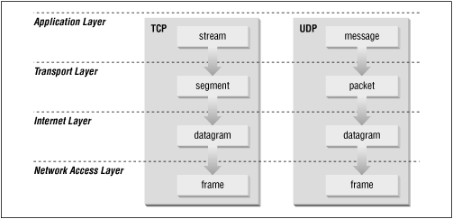
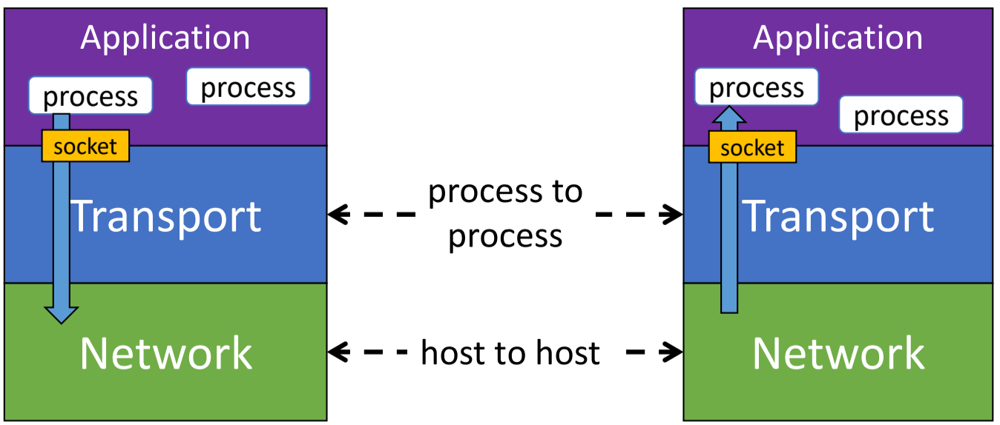
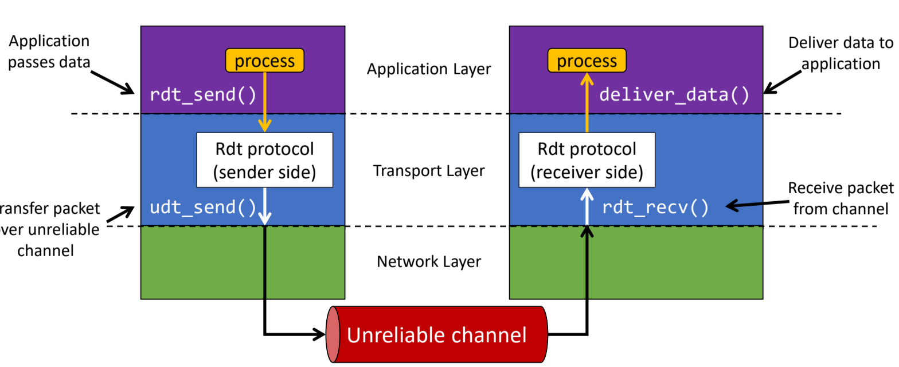
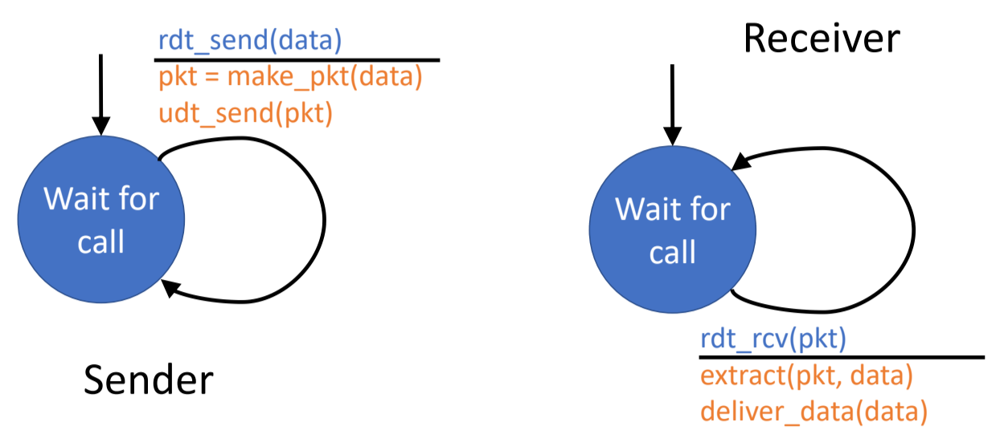
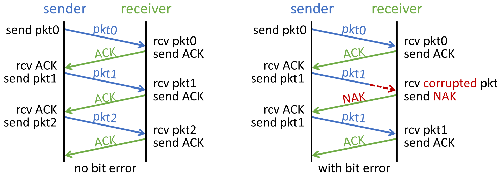
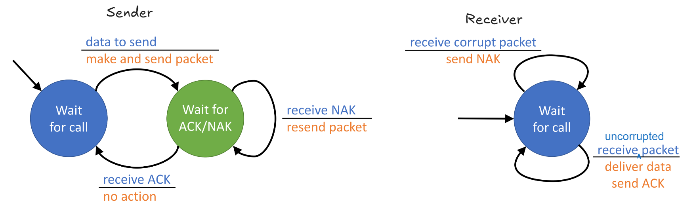
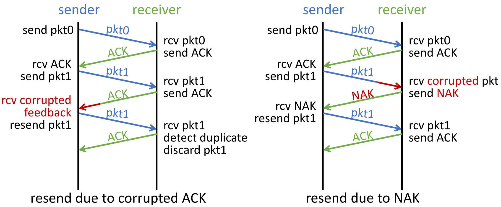
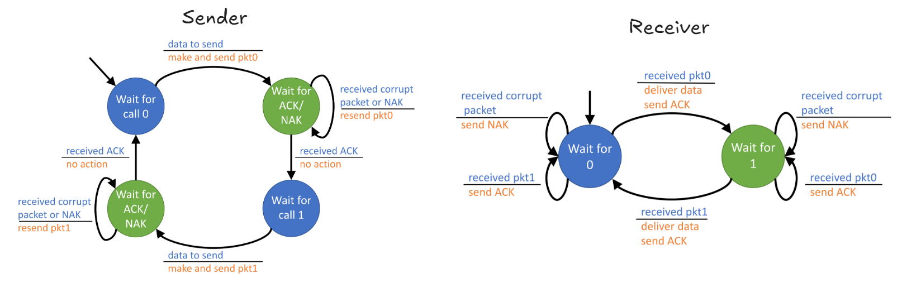
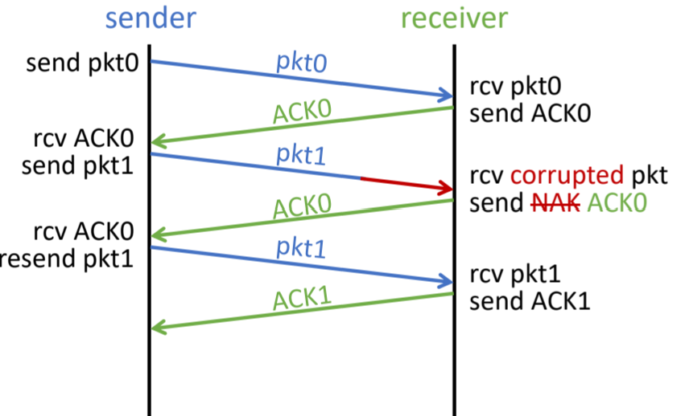

j## A. Week 3 Recap
#### DNS
- typically, the OS does the DNS resolving, not any certain or particular application
- works on UDP/53
- DNS is an application-layer protocol (which sits on top of the transport protocol UDP).
- translates host names into numerical IP addresses

**Order and Hierarchy**
- is distributed and hierarchical to achieve good performance
- contact the local DNS server, can be configured through OS settings (free to use the public DNS servers)
- local ask root DNS
- root ask to contact the TLD servers
- TLD server tells the address of domains (and subdomains as well)

#### Socket Programming
- when we create a socket, we are not obtaining a resource, but rather we are connecting to a host system
- is an API provided by the OS (programming wise).
- socket object is an abstraction
- socket contains the IP address and port number
	- usually binds to the active network adaptors (or interfaces)
	- LAN, WiFi, VPN, Virtual Interfaces in VMs etc.
- abstraction for UDP is a datagram socket.
	- if we specify a small buffer of $n$ bytes, then we read $\leq n$ bytes $\implies$ need to ensure that we read sufficiently
	- need to also limit the upper threshold if not socket connection will just be closed.

- no guarantee that all bytes will be delivered exactly, so need to do the appropriate checks.

Wai Kay's fuck up $\implies$ due to python accepting `\n`, when we wanted `\r\n`, when using `in_file.readline()`.
- `readline()` is useful because it reads all the way up to a newline character.
- we require `srv_socket.shutdown()`, if not `client_socket.recv(10)` is still blocking on the client, even though the server has already terminated the connection via `srv_socket.close()`.
- the argument within `socket.listen()` allows us to specify $n$ number of clients to put "on hold".

## B. Transport Layer and its Services
Internet's Transport layer has two main protocols -- TCP and UDP
- create connections and sockets to be used by applications
- allows for multiplexing to occur ($\geq 1$ connection per machine)
- deals with ordering, acknowledgement and pacing
	- Internet design is easier when routers can drop packets

1. **TCP**
	- connection oriented
	- reliable (will resend if fails)
	- ordering
		- data must be packetized by the sender and reassembled by the receiver
		- reassembly is done in the proper order, regardless of delivery order
	- acknowledgement (not exactly reliability)
		- deliver of each packet is acknowledge s.t. lost packets are retransmitted
	- pacing
		- avoid filling queues and overwhelming next hop or recipient

2. **UDP**
	- connectionless
	- unreliable (*no delivery guaranteed*), but it accepts the fact that packets can be dropped or lost
	- simpler alternative to TCP that uses a type of messaging like the Internet protocol (simple)
	- adds a source port number to distinguish different services on the machine (one process, one port) $\implies$ given same dest port
	- no data integrity (to certain extent)
		- adds a checksum to verify that data was not corrupted $\implies$ only guarantees detection of a single bit flip

**Some terminology**
Packet is the "general term" in this case.

Application: Message
Transport: Segment / Packets (src and dest port)
Network: Datagram (IP address)
Link: Frame (MAC address)

These protocols run in hosts systems, consisting of three components.
1. *Sender side*: breaks down application message into **multiple smaller segments** as needed and passes them on $\downarrow$ to the network layer.
	- much more complicated since it requires reassembly in the right order
2. *Receiver side*: reassemble segments into the complete app message and passes it $\uparrow$ to the above layer above it.
	- identified as the destination IP address `dest_ip`
3. *Packet Switches (i.e. routers)*: are the middleman which deliver packets, only check the destination IP on the network level of the TCP/IP model to decide how to route the packets.

#### IP Datagrams
- each of these carries $1 \times$ transport later segment (which contains `src_port` and `dst_port`).

#### UDP Checksum
- simple method to detect data corruption
	- split data into seq of $16$-bits
	- add the data to each other (16 by 16), until no more data $\implies$ pad to $16$ for last few bytes as necessary
- wrap the carry out bits to the LSB position

## C. Principles of reliable data transfer
- should make the least possibly assumptions
	- fact that the network layer is of "best effort" and is inherently unreliable.
	- **key question:** how to make transport later reliable if network layer does not guarantee reliability?

- characteristics and complexity will depend strongly on the characteristics of the unreliable channel (lost, corrupt or reordered data)

- assume that sender and receiver don't know the state of the other unless a message was sent
	- considering only unidirectional data transfer

- Transport layer provides inter-process communication ($\geq 2$ processes at once) through the specification of source and network ports
	- is the conduit between the application to the transport layer protocol
- Meanwhile, the network layer is host-to-host only, provides best-effort unreliable service (and it is a service as well)
- $\therefore \:$ sending data reliably is **quite hard**.
#### Message Loss, ACK and NACKs
- positive acknowledgement to affirm receipt of message
	- **maybe** will repeat or ask for status
	- we tend to use positive ACKs instead of NACKs
- negative acknowledgement, which will **definitively** ask sender to repeat again if something is lost (i.e. through the use of retransmissions)

**Dealing with lost acknowledgements**
1. Sender cannot make progress, so gives up
2. Sender continues sending, but Recipient cannot recover lost messages, so gives up
#### Consequences of unreliable channel
1. Corrupted Packets (i.e. is a very generic term)
2. Dropped Packets (packet lost)
3. Re-ordered (out of sequence) packets
4. Packets are delivered, but after arbitrarily long delay (not good to keep the recipient process waiting)
### Reliable Data Transfer Model
Hence, the need of end-to-end reliable transfer (or transport) protocol, with the following properties:
- recall that the protocol is a *set of rules*
- guarantees packet *delivery and correctness* (no corruption)
- deliver packets to application process in the *same order* when sent (or at least, in order and sequential *after reassembly*?)

**rdt** is an abstract model
1. Client call `rdt_send()` and transport call `udt_send()`
2.  Transport call `udt_recv()` and then server call `deliver_data()`

- Complexity of the `rdt` protocol is dependent on the **degree of its unreliability**
	- only to consider **one direction of data transfer**, even though control info(or feedback) may flow both ways (bidirectional)
#### Finite State Machine
Used to describe the properties of a sender and receiver
- is a graph, where the nodes are the state.
- *directed edges* help to tell how to get from one edge to another, might have some conditions attached to it.
	- conditions are denoted as "$\frac{Event}{Action \: taken}$"
- ==$\exists$ starting edge, but *may not* have ending state.==

#### FSM - `rdt 1.0`
- assume underlying channel is **fully reliable**

- `make_pkt()` and `udt_send()` is contingent on `rdt_send()` being called
- FSM is relatively simple with one node on both sender and recipient sides
	- sender sends data into underlying channel
	- receiver receives data from underlying channel
- wait for call always transitions back to itself
#### `rdt 2.0`
- utilizes an underlying stop and wait protocol
- some unreliability in terms of **data corruption** and **bit flips** ($0 \to 1, 1 \to 0$)
- other than that channel is perfect

- use of **checksums** on recipient's end to detect errors and feedback to the sender
- recovering from bit errors via mechanisms of ACK / NAKs
	- Acknowledgements (ACK): receiver tells sender that packet is OK
	- Negative ACKs (NAK): receiver tells sender that packets has errors (by retransmitting the corrupted packets)
		- senders will retransmit when they receive a NAK

##### Stop-and-wait protocol

- Sender will have two states
	- Wait for Call
	- Waiting State: only when receive NAK, then retransmit correct packet

- Receiver will only have one
	- Wait of call (i.e. receiving packets)

- Fatal Flaw: What is ACK/NAK is corrupted? 
	- sender doesn't know what happens at the receiver (i.e. if the ACK sent by the receiver back to the sender is corrupted).
	- need some mechanism for *detecting duplicates packets* on the recipient's end.

#### `rdt 2.1`
- use of a **sequence number** by the sender to each packet (sort of as a unique ID)
- sender  still retransmits current packet if ACK/NAK is distorted
- receiver discards the duplicated ones

##### FSM for `rdt 2.1`

#### FSM - `rdt 2.2`
- gets rid of NACK, replace with an NACK with ACK sequence number.
- no need to send the entire corrupt packet (fewer bytes?)

#### FSM - `rdt 3.0`
- packet can be lost and/or corrupted

Assumption of the underlying channel
- flip bits in packet
- lost packets
- arbitrarily long packet delay
- will not help to re-order packets.

Detection Mechanism
- cannot use checksums, ACKs/NACKs and sequence numbers
- instead, just resend after some time (retransmit on timeout)

If ACK is delayed, we might have duplicate ACKs receive from the sender side
- duplicate ACKs $\implies$ **don't resend** packet 0 again

What if the network channel can now reorder segments (will cause RDT 3.0 will break)
- as long as no re-arrangement or delay RDT 3.0 will work.
### Summary of `rdt` protocols, Motivation for Pipelined protocols
- rdt has bad performance
- rdt is a *stop and wait protocol*
- utilization of the link is very low (not leveraging resources properly)
	- we want $\approx 100\%$ utilization 
	- can utilize pipelining, for repeated sends without ACKs (not acknowledged *yet*).
		- should have sequence numbers must be increased *more bits needed*
		- buffering at the sender and/or receiver's end (make sure segments are sent and received in order)

- same assumptions as `rdt 3.0`
### Go-Back-N
- also called the cumulative ACK protocol, where ACK $n$ means $1, 2, \ldots \leq n$ are received.
- retransmits everything in its sliding window when there is a timeout

**Properties**
1. Dark green (ACK-ed)
2. Light Green (Packets to be sent currently)
3. Slots (have not sent yet, in sender's buffer)
4. Window Size of $n$ at the Server $\implies$ up to $n$ packets can be sent at once
	1. $n$ is finite
	2. should be modified accordingly to ensure maximum utilization

5. Timer on the window: set for the oldest un-ACK-ed packet 
	1. timeout $\implies$ all packets currently in the window retransmitted
	2. will cause server to autosend some packets once the timer is hit

**Recipient**

### Selective Repeat
- One ACK for each packet, can only move  on when all packets to that point have been ACK-ed
- buffers the out-of-order packets to prevent sender from having to resend.
- Times maintained for all un-ACK-ed packets
	- timer expire, only retransmit target un-ACK-ed packet

- `send_base` $\implies$ last unacknowledged packet
- Inconsistencies: `ACK` missing due to lost or on the way back to sender (i.e. "in-flight")