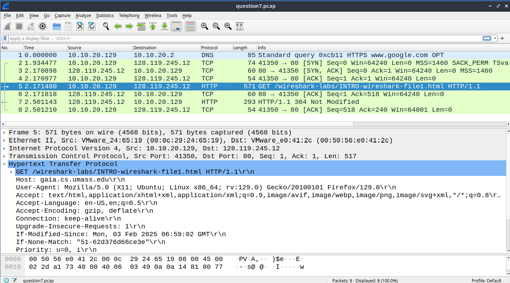
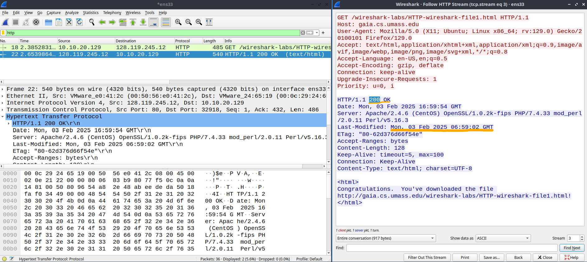

### Q1
```
GET /index.html HTTP/1.1
Host: www.example.org
Connection: keep-alive 
User-Agent: Mozilla/5.0 (Windows NT 10.0; Win64; x64) AppleWebKit/537.36 (KHTML, like Gecko) Chrome/71.0.3578.98 Safari/537.36
Accept-Encoding: gzip, deflate
...
```
##### a) What is the URL of the document requested by this browser?
A: `http://www.example.org/index.html`

##### b) What version of HTTP is this browser running?
A: `HTTP/1.1`

##### c) Does the browser request a non-persistent or a persistent connection?
A: Persistent $\implies$ derived from the key-value pair of `Connection: keep-alive`.

##### d) What is the IP address of the host on which the browser is running?
A: Cannot be derived. Not enough info. Also IP address is included as part of the IP header, not HTTP or TCP (in wireshark).

---
### Q2
```
HTTP/1.1 200 OK
Content-Encoding: gzip 
Content-Type: text/html; charset=UTF-8
Date: Wed, 23 Jan 2019 13:50:31 GMT
Last-Modified: Fri, 09 Aug 2013 23:54:35 GMT
Connection: Keep-Alive
Content-Length: 606
...
```

##### a) Was the server able to successfully find the document or not?
A: Yes the response code is `200 OK` indicating the document was successfully retrieved

##### b) What time did the server send the HTTP response message?
A: `23:54:35 GMT+0000` on 09 Aug 2013

##### c) How many bytes are there in the document being returned?
A: `606` bytes (derived from the `Content-Length` field)

##### d) Did the server agree to a persistent connection?
A: Yes. As part of the `Connection` header field, a value of `Keep-Alive` was returned, suggesting the presence of a persistent connection as part of the TCP server accept response.

---
### Q3: to answer `True` or `False`
##### a) A user requests a Web page that consists of some text and three images. For this page, the client will send one request message and receive four response messages. 
A: `False`, because one request message is only valid for one specific resource. To retrieve four resources, the user needs to made four separate requests.

##### b) Two distinct Web pages (for example, `www.mit.edu/research.html` and `www.mit.edu/students.html`) can be sent over the $\underline{\textbf{same persistent connection}}$.
A: `True`, once a persistent connection is established, can send resources over until the connection is closed (by either end), whether abruptly or not, for the same server (in this case the web server is at `www.mit.edu`).
##### c) The `Date:` header (field) in the HTTP response message indicates when the object in the response was last modified.
A: `False`, the `date` header field should contain the time in which the resource was provided back to the client and **not** the last modification time of the object.

##### d) HTTP response messages never have an empty message body.
A: `False`, possible for the message body to be empty, but not the message or response header. Example being conditional `GET` where response contains no objects if cached copy is the latest.

---
### Q4) 
##### Suppose within your Web browser, you click on a link to obtain a Web page. The IP address for the associated URL is $\underline{\text{not cached}}$ in your local host, so a DNS lookup is necessary to obtain the IP address.

##### Suppose that $n$ DNS servers are visited before your host receives the IP address from DNS; visiting them incurs an RTT of $D_{DNS}$ per DNS server.

##### Further suppose that the Web page associated with the link contains $m$ very small objects (in addition to the HTML page). Suppose the HTTP running is non-persistent and non-parallel. Let $D_{Web}$ denote the RTT between the local host and the server of each object.

##### Assuming zero transmission time of each object, how much time elapses from when the client clicks on the link until the client receives all the objects?

$$
\begin{aligned}
\text{RTT Time (DNS)} \: &=  n \times D_{DNS}\\ \\
\text{RTT (req + resp)} \: &= 2m \: \times D_{Web}  \\\\
\text{RTT (html)} &= 2 \times D_{Web} \\ \\
\therefore \text{Total RTT Time} &= n \times D_{DNS}  \: + 2(m  + 1)\: \times D_{Web}
\end{aligned}
$$

---
### Q5) Referring to the previous question, suppose that three DNS servers are visited. Further, the HTML file references five very small objects on the same server. Neglecting transmission delay, how much time elapses with:

##### a) Non-persistent HTTP with no parallel TCP connections?
As per the question, we have determined that $n = 3, m = 5$.

Note that for each of the $5$ connections, a setup is needed, since the connection is non-persistent.
$$
\begin{aligned}
\text{RTT Time (DNS)} \: &=  3 \times D_{DNS}\\ \\
\text{RTT (req + resp + html)} \: &= 2(5 + 1) \: \times D_{Web}  \\\\
\therefore \text{Total RTT Time} &= 3 D_{DNS}  \: + 12D_{Web}
\end{aligned}
$$
##### b) Non-persistent HTTP with the browser configured for five parallel connections?
$$
\begin{aligned}
\text{RTT Time (DNS)} \: &=  3 \times D_{DNS}\\ \\
\text{RTT (5 of req + resp)} \: &= \left(\frac{N}{P}\times D_{Web} \right) = \frac{10}{5} \: \times D_{Web} = 2 \: \times D_{Web} \\\\
\text{RTT (html)} &= 2 \: \times D_{Web} \\\\
\therefore \text{Total RTT Time} &= 3 D_{DNS}  \: + 4D_{Web}
\end{aligned}
$$

##### c) Persistent HTTP with pipelining?
We assume for persistent HTTP, $\lt 1$ RTT **for all** of the $m$ (or 5) objects.
$$
\begin{aligned}
\text{RTT Time (DNS)} \: &=  3 \times D_{DNS}\\ \\
\text{RTT (5 of req + resp)} \: &\leq 1 \times D_{Web} \\\\
\text{RTT (html)} &= 2 \: \times D_{Web} \\\\
\therefore \text{Total RTT Time} &\approx 3 D_{DNS}  \: + 3D_{Web}
\end{aligned}
$$

---
### Q6) Do you know what is DNS cache poisoning? Search online for a real example.
2018 attack on an ISP to reroute traffic from Amazon's Route 53 service to attackers website hosted on a Russian server, targeting MyEtherWallet Users.

This DNS hijack lasted 2 hours.

---
### Q7) Wireshark Exercise

##### a) What is the status code returned from the server to your browser?

A: `304`, Not Modified

*Part b not applicable for Q7.*
### Q8

##### a) What is the status code returned from the server to your browser?

A: `200`, OK

##### b) When was the HTML file that you are retrieving last modified at the server?
A: `Mon, 03 Feb 2025 06:59:02 GMT+0000`