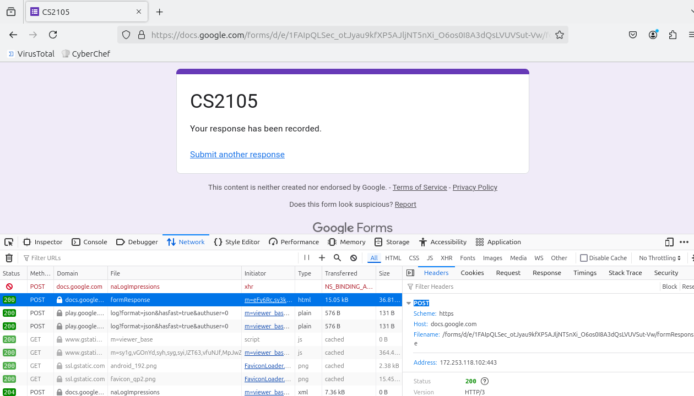

#### Q1) Launch your browser and open its network diagnostic tool (e.g. press F12 if you use Chrome on Windows, or Cmd + Opt + I for Mac). Then click the “Network” tab to observe network communication. Copy-and paste the following URL in the address bar of your browser:` http://tiny.cc/atupaz`. Enter your choice and press the “Submit” button.



##### Part a) Look at the entry named `formResponse`. What is the `HTTP request method` issued?
A: `POST`
##### Part b) Briefly explain when HTTP POST and GET methods are used.
A: HTTP GET is used by a client to request for resources from a server. Whereas HTTP POST is used by a client to send data (usually encoded using some scheme in the request body) to a web server, typically used in online forms (like in the above).

#### Q2) Suppose that your department has a local DNS server for all computers in the department. You are an ordinary user (i.e., not a network/system administrator). Can you determine if an external Web site was likely accessed from a computer in your department a couple of seconds ago? Explain.

A: We can use the `dig` or `nslookup` commands to determine if there might be cached external webpages with the appropriate hostname to IP address mapping.
#### Q3a) You are given 4 programs: `TCPEchoServer.py`,`TCPEchoClient.py`, `UDPEchoServer.py` and `UDPEchoClient.py`. Suppose you run `TCPEchoClient` before you run `TCPEchoServer`. What happens? Why?
A: We get a connection refused error as follows. This is because we do not have a server port `12000` that is open on our local machine (i.e. localhost) that is listening for active incoming connection requests. 

In addition, the fact that TCP is connection-oriented suggests that a proper setup of the connection is needed before data is transferred.

```
ConnectionRefusedError: [WinError 10061] No connection could be made because the target machine actively refused it
```
#### Q3b) Suppose you run `UDPEchoClient` before you run `UDPEchoServer`. What happens? Why?
A: Unlike in the case of the TCP Client, there is no error message generated when running the UDP Client before the Server. This is because UDP is connectionless and thus does not require a connection to be establish before it sends data, much less the need to verify if the server port that is waiting for incoming connections.

```powershell
$ python .\UDPEchoClient.py
Input lowercase sentence:hello world
HELLO WORLD
```
#### Q4) Suppose a process in Host C has a UDP socket with port number `6789`. Suppose both Host A and Host B each sends a UDP segment to Host C with destination port number `6789`. Will both of these segments be directed to the same socket at Host C? If so, how will the process at Host C know that these two segments originated from two different hosts?
A: Yes, both segments will both be directed to the same socket open on port `6789` on Host C. The socket application process will be able to differentiate the two segments by extracting the source IP address and port combination (by means of `getAddress()` method) from each received segment before it reattaches the response that it has to the segment to be sent back.

#### Q5a) Suppose you have the following 2 bytes: `01011100` and `01100101`. What is the 1s complement of the sum of these 2 bytes?
$$
\begin{aligned}
&\begin{array}
{cccccccc} & {\scriptstyle 1} & {\scriptstyle 1} & {\scriptstyle 1} & {\scriptstyle 1} &  {\scriptstyle 1} &  {\scriptstyle 0} & {\scriptstyle 0} & \\ & \\  & 0 & 1 & 0 & 1 & 1 & 1 & 0 & 0 \\ 
\text{\large$+$} & 0 & 1 & 1 & 0 & 0 & 1 & 0 & 1 \\ \hline    
& (1 & 1 & 0 & 0 & 0 & 0 & 0 & 1)_2
\end{array} \\\\
\text{Checksum} &= \boxed{(0011\: 1110)_{1s}}
\end{aligned}
$$
#### Q5b) Suppose you have the following 2 bytes: `11011010` and `01100101`. What is the 1s complement of the sum of these 2 bytes?
$$
\begin{aligned}
&\begin{array}
{cccccccc} {\scriptstyle 1} & {\scriptstyle 1} & {\scriptstyle 0} & {\scriptstyle 0} & {\scriptstyle 0} &  {\scriptstyle 0} &  {\scriptstyle 0} & {\scriptstyle 0} & \\ & \\  & 1 & 1 & 0 & 1 & 1 & 0 & 1 & 0 \\ 
\text{\large$+$} & 0 & 1 & 1 & 0 & 0 & 1 & 0 & 1 \\ \hline  \\
{\scriptstyle 0} & {\scriptstyle 0} & {\scriptstyle 1} & {\scriptstyle 1} & {\scriptstyle 1} &  {\scriptstyle 1} &  {\scriptstyle 1} & {\scriptstyle 1} & \\ & \\
& (0 & 0 & 1 & 1 & 1 & 1 & 1 & 1)_2 \\
\text{\large$+$} &  & &  &  &  & & &  1 \\ \hline 
& 0 & 1 & 0 & 0 & 0 & 0 & 0 & 0
\end{array} \\\\
\text{Checksum} &= \boxed{(1011 \: 1111)_{1s}}
\end{aligned}
$$
#### Q6) Suppose that UDP receiver computes the checksum for the received UDP segment and finds that it matches the value carried in the checksum field. Can the receiver be absolutely certain that no bit errors have occurred? You may use Q5 as an example to explain.
Yes. If we have some flipped bits that were applied to the mask, i.e. the target being `11011010` instead of `01100101`, then we obtain a completely different checksum value, so we can be quite sure that there are no bit flips.
#### Q7) In our `rdt` protocols, why did we need to introduce sequence numbers?
Sequence numbers were added to deal with duplicate packets in `rdt 2.1`, in the case where ACK/NAK is garbled. This is to prevent the client from thinking that we as the server have intentionally sent two pieces of the same message when the packets are reconstructed again, when in actuality, it was just a retransmission.