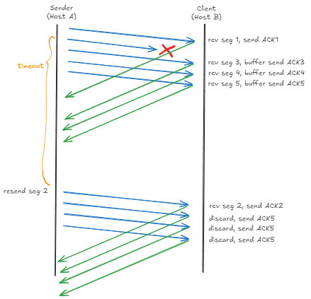
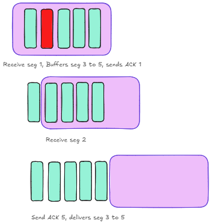
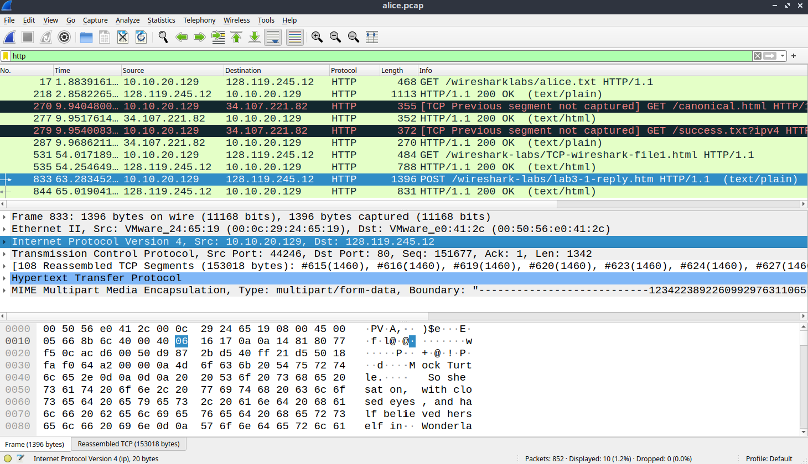

### Lecture Recap
- TCP buffers packets, similar to Selective Repeat. On the other hand, Go-Back-End does not buffer packets


#### TCP Sender Events
- 3 types of events
	1. receive app data
		1. create TCP segments and pass it to the IP layer
	2. Timeout
		1. retransmit the oldest un-ACKed packet
	3. ACK received
		1. for new ACK, then we update the window (if we have yet to receive that sequence number before)
### TCP Receiver Events
- receives in-order segment
	- no pending ACK, delay the ACK for up to 500 ms
	- 1 other pending ACK: Immediately ACK

- receives out-of-order segment: immediately send duplicate ACK
- receives out-of-order segment - sends a duplicate ACK

### Other Topics in TCP
TCP Setup
- 3 way handshake $\to$ SYN, SYN/ACK, ACK
- Closing $\to$ FIN + ACK, FIN + ACK

Maximum Segment Size
- break down message that is too big
- size of each segment is determined by the MSS

Estimating the RTT to set the timeout value
- based on a moving average

Piggybacking
- to enable full-duplex transmission

Flow Congestion
- to ensure that receiver is not overwhelmed

Congestion Control
- ensures that the network is not overwhelmed

### UDP
- does not handle packet corruption by default
- also may not handle packet loss and packet delay
- Q1: since transport layer cannot handle reliability, then we let the application layer handle it instead

---
#### Q1. Is it possible for an application to enjoy reliable data transfer even when the application runs over UDP? If so, how?
A: Yes, it is possible through `rdt 1.0`, where the data transfer is perfectly reliable and there is no error checking required because the underlying channel is reliable, either that of if it is another variant, we can use mechanism such as ACK, sequence numbers, use of checksum and timeout to guarantee deliver.

- Application layer introduces a timer
#### Q2. Show an example that if the communication channel between the sender and receiver can reorder messages (i.e. two messages are received in different order they are sent), then protocol `rdt3.0` will not work correctly.
In `rdt 3.0`:
- packet corruption, loss and delay can possibly occur
- but packet reordering cannot occur

Receiver is unable to distinguished between actual pkt 0 and retransmitted pkt 0. Possible for one packet to take longer than another to be delivered

#### Q3. It is generally a reasonable assumption, when sender and receiver are connected by a single wire, that packets cannot be reordered within the channel between the sender and receiver. However, when the “channel’ connecting the two is a network, packet reordering may occur. One manifestation of packet reordering is that old copies of a packet with a sequence or acknowledgement number of $x$ can appear, even though neither sender’s nor receiver’s window contains $x$. With packet reordering, the channel can be thought of as essentially buffering packets and spontaneously emitting these packets at any point in the future. What is the approach taken in practice to guard against such duplicate packets?
A: The use of `sequence numbers` that have enough capacity (in terms of the number of bits) help to guard against duplicate packets. If a duplicate packet is received by the receiver (due to the ACK/NAK being garbled), then he will use the sequence number to check if he has already received the packet. If the packet has already been received, then it will be discarded.

- use large sequence number (beyond just pkt0 and pkt1) $\implies$ prevent number of times when reuse is needed
	- prevent old packets from being interpreted as new packets

- use the `TTL` field which is standard across all endpoints, `TTL` is decremented and packet is dropped when `TTL` reaches $0$.

#### Q4*. Host A is sending data segments to Host B using a reliable transport protocol (either GBN or SR). Assume timeout values are sufficiently large such that all data segments and their corresponding ACKs can be received (if not lost in the channel) by Host B and the Host A respectively. Suppose Host A sends 5 data segments to Host B and the 2nd data segment is lost. Further suppose retransmission is always successful. In the end, all 5 data segments have been correctly received by Host B. How many segments has Host A sent in total and how many ACKs has Host B sent in total if either GBN or SR protocol is used? What are their sequence numbers? Answer this question for both protocols.

- assume windows size = # packets if not specified
- ⚠️ Important for exam!


In selective repeat, Host A sends **9** segments and has **8** ACKs in total.



Go-back-N sends **6** segments in total and had **5** ACKs

#### Q5. Suppose Host A sends two TCP segments back to back to Host B over a TCP connection. The first segment has sequence number $65$; the second has sequence number $92$.

##### a) How much data is in the first segment?
$92 - 65 = 27$ bytes

##### b) Suppose that the first segment is lost but the second segment arrives at B. In the acknowledgment that Host B sends to Host A, what will be the acknowledgment number?
`ACK 65`.
- next packet that it expects to receive (sent immediately upon receipt)
#### Q6. Consider transferring an enormous file of $L$ bytes from Host A to Host B. Assume an MSS of $512$ bytes.

##### 1. What is the maximum value of $L$ such that TCP sequence numbers are not exhausted? Recall that the TCP sequence number field is 32 bits.
$2^{32}$ bytes (assuming sequence number starts from zero)

##### 2. For the $L$ you obtain in (a), find how long it takes to transmit this file. Assume that a total of 64 bytes of transport, network, and data-link header are added to each packet before the resulting packet is sent out over a 155 Mbps link. Ignore flow control, congestion control and assume Host A can pump out all segments back to back and continuously.
$$
\begin{aligned}
\text{\# of packets} &= 2^{32} \text{ bytes} \: \div \: 512 \\
&= 8388608 \text{ bytes}\\\\
\text{Total size of all packets} &=   \text{Total data bytes} + \text{Total header bytes} \\
&= 2^{32} + (8388608 \times 64) \\
&= 4831838208 \text{ bytes} \\\\

D_{\text{trans}} &= \frac{L}{R} \\
&=(4831838208 \times 8) \text{bits} \div (155 \times 10^6) \\
&\approx 249.39 \text{ sec}
\end{aligned}
$$
$L$ is the amount of the data to be transmitted
$R$ is the bandwidth

- MSS: data only
- MTU: data + headers included

#### Q7i) What is the IP address and TCP port number used by the client computer (source) that is transferring the file to gaia.cs.umass.edu?

Filter using `http`.
Observe the `POST` request.

Then `src_ip` is `10.10.20.129` and `src_port` is `44246`

#### Q7ii) What is the IP address of `gaia.cs.umass.edu`? On what port number is it sending and receiving TCP segments for this connection?

From the above, `dst_ip` or IP address of `gaia.cs.umass.edu` is `128.119.245.12` and `dst_port` is `80`.

Can also use `nslookup` command line utility to double confirm the IP address.
```powershell
nslookup gaia.cs.umass.edu
Server:  resolver9.nus.edu.sg
Address:  172.19.215.140

Non-authoritative answer:
Name:    gaia.cs.umass.edu
Address:  128.119.245.12   <-
```

