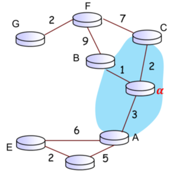
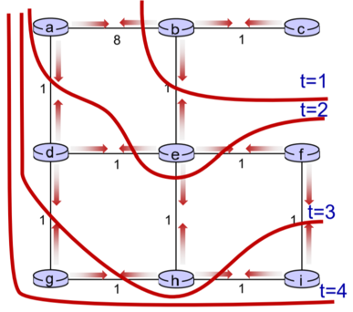

## A. Recap on Part I
- a software is basically a string of bits
- network layer is meant to **establish or provide connection** between **any two hosts** in a network, for the purposes of communications
	- the main responsibility of the network layer
	- the transport layer only offers reliability on top of it (network layer itself is not reliable)

- all of the **intermediate nodes** have to be **cooperating** with each other (i.e. we use the same sort of protocol)
	- motivation could be money, owned by a corporation etc.
	- expect all the nodes on the path to be cooperating in nature

**Assumptions**
- for **client-server model:** server is always listening when we wish to connect
- the Internet is technically just a **network** that is **interconnected**

**Motivation**
- IP address is not **associated** with a host, but rather with a **network interface**
	- belongs to an interface, or the ethernet card

- IP Address are assigned by IANA in blocks (i.e. subnets), **not randomly**
	- allows for route aggregation
	- match by the *closest prefix* $\implies$ greatly reduces the # records a router needs to keep
	- should be globally unique (outside of private IP address ranges)
		- is a $32$-bit unique identifier
		- can technically manually configure two of the same private IP addresses, but not advisable (DHCP auto config should prevent this from happening, by issuing leases for IP addresses)

- Routing and forwarding table are interchangeable w.r.t. routers

**Hierarchical Addressing**
- ISP assigned with a block of IP addresses and wants to split it up to $\geq 1$ organizations

- IP address is provided in blocks (i.e. the subnet mask enables us to match the **longest** network prefix)
	- enables us to do **route aggregation** $\implies$ only needs to know the longest host prefix which connects the subnets (reduces the size of routing tables)
		- ($\implies$) all the other router needs to know is how to send the packet to the edge router, and not the # subnets within the destination network of subnets.

	- router can advertise generic IP block that it can route to (i.e. `/20` addresses), even though its subnets may have a longer subnet prefix (i.e. `/23` addresses)

- when transferring a subnet to a **different ISP**, may need to change the ISP block (change from one to another ISP)
	- alternative solution is to use a much more specific subnet (need to change the IP address block)

- IP address need to be stored as a *binary string* of bits, not as decimal numbers! (what it is represented by)
	- *every router* can have entries that match different set of IP addresses, but we take the **one with the longest prefix** (longest prefix has to exactly match the subnet address or network bits belonging to the subnet)
		- is not strictly hierarchical in this manner (regardless of the larger hierarchy of the network $\implies$ "parent relations" between specific IP and subnet ID that matches it) 
		- **longest prefix match** is about **specificity**, not hierarchy of routing

	- need to have information about the **router's IP** (default route) and the **next hop's interface** to be able to transfer the packet (see below)

**Routing Table Entry components**
1. Destination IP Address
2. Next hop IP / Router's name $\to$ to whom to send this to
3. Next hop's interface (to determine **how** the packet is constructed)

**Concept of Longest Prefix Match**
> When looking for a forwarding table's entry for a given destination IP address, we use the longest address prefix that matches this destination IP address
## B. Abstract View of Intra-AS Routing, Graphs and Bellman-Ford
### Shortest Path Routing
- finding paths of connectivity between hosts on the network
	- we don't need to find the path connecting the two hosts, rather, we need to find the path connecting the two edge routers, to ensure the delivery of the packet

- we can take the problem as a graph problem
	- **routers** are the **nodes / vertices**
	- **links** are the **edges**
	- this becomes a shortest path problem between some $n$ nodes

**Shortest Path**
- we want to find the shortest path
- we can assume cost $=1$ (if we don't wish to do any extra config)
	- can also take cost another quantitative metric (i.e. dollars, congestion time, bandwidth, distance etc.)
- want to have the least # hops from one endpoint $A$ and another $B$ (minimize the number of routers to be past through, or the minimum number of hops between **two vertices**)

**Constraint**
- every path only has information about its **immediate neighbours**
- router $\alpha$ has no info that there is router $\gamma$ on the network
	- only aware that the cost to reach its neighbour $C$ is $2$, $B$ is $1$ and $A$ is $3$
	- despite this, should be able to reach every single node present in the network
		- all the nodes run the same algorithm, but the algorithm should **converge to the same solution** of finding the shortest path

		

**Notation**
- $C_{x, y} \implies$ costs of the link from $X$ to $Y$ (from router X and router Y)
- $D_x(y) \implies$ cost / distance of least-cost path from $X$ to $Y$ (would be an estimate first, then it converges to a "stable" value)
- note that the cost $C_{x, y} = \mathbf{\infty}$ at first if the node is **not directly reachable** by direct link (not the next hop)

Neighbours can tell the node about their least-costing route to endpoint router $Z$
- principle of abstraction (tell don't ask) $\implies$ don't need to know how the neighbour reaches the node $Z$
### Bellman-Ford Equation
- bellman-ford / routing protocol runs on each router (the source)
- destination info will keep changing based on what is advertised
- takes some time to converge (for every node to know what is the shortest path)
	- there is **no single starting or ending point**
	- we take the path with the **least cost** (each edge is denoted as $x$)
	- in each iteration, we add the edge's weight to our cost from going from $X$ to $Y$, until we obtain the full cost to get to $Y$

$$
D_{x}(y) = min_{x \in N} \{c(x, v) + D_{v}(y)\}
$$

**Inputs to the equation**
- for example, $x$ needs to know cost from **each of its direct neighbour** to router $y$ (i.e. the destination), which **may or may not be directly connected** to it

- to find the cost of the least cost path, we take the **minimum element** of the set with the sum of the $(\text{cost from \(x\) to neighbour node \(v\)}, \text{cost from neighbour to dest \(y\) [advertised]})$
	- each router would also need to have the pre-configuration of how much it costs to reach its direct neighbours (it is a pre-configuration value that we don't really care about) i.e. $c(x, v)$
	- if directly connected already, cost from neighbour $v$ to $y = 0$ (i.e. $v = y$ in this case) 
	- the minimum is taken over all neighbours $v$ of $x$

**Properties**
- Decentralized in nature, since every node determines the cost to other nodes through either direct connection (neighbours), or based on the least cost as advertised by their neighbours
## C. Distance Vector Model
- initially each router has no information about the destination (i.e. $\infty$ or not direct calculated)
- each router should advertise or broadcast what it is connected to, to the others (done by every router)

- we assume that all routers are turned on simultaneously at $t = 0$
- at $t = 1$, we use the bellman ford equation to compute the shortest path advertised by neighbours, then advertise again
#### C1. Iteration
- assumes all routers are **turned on simultaneously** and the clocks of the routers are somewhat "coordinated" and running synchronously
$t = 0$
- all nodes **have** distance estimates to directly connected neighbours only
- all nodes **send** their local distance vectors to neighbours

$t = 1,2 \ldots$
- all nodes will **receive** distance vectors from neighbours (all nodes can now reach more nodes aside from their direct neighbours) and based on that, **make changes** to distance vector if necessary
	- i.e. $min(\infty, k) = k \implies$ update to $k$ cost
- all nodes **send** their local distance vectors to neighbours (broadcast)
#### C2. Computation
- perform addition operation of $\text{next hop to advertised} + \text{cost of current to next hop}$
- entries are not $\infty$ when the routing table converges (all should not be infinite)
#### C3. Algorithm
- this is an *asynchronous algorithm*, but we assume the clocks of different machines are synchronous
- wait for a **change in the local link cost** (from $\infty$ or something to a lower value) $\to$ recompute distance vector estimates using $DV$ received from neighbour $\to$ if distance vector to any destination has change, change internally via local $DV$ and then notify neighbours

- change in link cost ($\triangle$ cost)
	- link go down (cost becomes $\infty$)
	- congestion of link (cost goes up)

- if there is no change, there is no need for computation and notification

- the router constantly runs the routing algorithm
	- all the other router needs to know is that it has a routing table
	- recompute the estimates to see is there is any change in its Distance Vector and then propagate to neighbours 

- drop packet if cannot reach the other node 
##### Routing Table
- what is the next hop (the cost)
- the destination (expands as router stays on the network for longer)
- *Components*:
	- What is the destination (i.e. `dest_ip`, or the **network address**) $\implies$ recall that **socket address** $=$ IP + port
	- next hop address (would usually change during re-computation)
	- metric (cost, would usually change during re-computation)
##### Properties
1. **Iterative and Asynchronous**: each local iteration is caused by
	1. Local link Cost change
		- link go down, interface died (cost becomes $\infty$)
		- congestion of link (cost usually goes up), predetermined by router perhaps
			- run the algorithm again

	2. Distance Vector update message from neighbour

2. **Distributed and Self-stopping**
	- each node identifies neighbours **only when** its own distance vector changes (and then updated DV value is propagated across the network)
	- neighbours notify other neighbours as necessary $\implies$ if no notifications are taken, there will be no actions to update $DV$ or broadcast $DV$
#### C4. State Information Diffusion
We are looking at the past information about cost (it is already the old information), but we still process it because all the routing information will **eventually converge**.
- at $t= 0$s, the info of router $c$'s state is only known at $c$ itself only (the direct connection costs)
- at $t = 1$s, $c$'s state has propagated to $b$ and may influence distance vector computations of **up to 1 hop away** (i.e. at $b$)
- at $t = 2$s, $c$ 's state could influence $DV$ computations of **up to $2$ hops away** (i.e. at $a, e$)
- In general, at $t = \textbf{k}$s, $c$ 's state could influence $DV$ computations of up to $\textbf{k}$ hops away

- information diffuses to the next hop, one hop at a time at each time interval
	- we don't need to bother about the end devices $A$ and $B$, but rather, we are concerned about how control information flows (state info for routing) flows from router $X$ to router $Y$
		

- the diameter of the network is the upper bound of the network
## D. Routing Information Protocol (RIP)
- implements the distance vector algorithm
	- uses the hop count as the cost metric
	- insensitive to network congestion
- sends the distance vector every $30$ sec, o n `520/udp`
	- if no update from neighbour in $3$ mins (i.e. $6$ update cycles), assume neighbour has failed, reset cost to $\infty$
- **most simple** routing protocol that we can have
- RIP is an application layer protocol, not a network layer protocol (i.e. running on top of transport layer UDP)
	- provides a **service for the network layer**
## E. Routing Algo Classification
- use of link state algorithms
	- **don't restrict** info only to **immediate neighbours**
	- all routers have complete knowledge of the complete topology
		- create a link state to create a "global" view of the network

- use Dijkstra's to compute least cost path directly (non-examinable)
	- i.e. OSPF

- for a router to function, it will need to have at minimum a **forwarding table**, don't necessarily need routing protocols
	- can just manually configure the routing tables

- A routing protocol is a mechanism by which a forwarding table is constructed (form of automation)

- routing protocols are run in hierarchy because not all of them may wish to cooperate with one another
## F. Details of Intra-AS / Inter-AS Routing
**Intra-AS Routing**
- routing within the AS itself, protocols don't necessarily need to communicate with each other (i.e. NUS can have a different routing protocol from NTU)
- **cost optimization** is the main consideration
- OSPF, RIP

**Inter-AS Protocol** (not tested)
- amongst different ASes
- admin often wants control over how traffic is routed and which routers route what traffic
- **politics and policy decisions** is the main consideration, rather than cost or performance
- BGP

**Network Layer Services**
- **IP protocol** -- Addressing conventions, datagram formatting, packet handling protocol
- **Forwarding table** -- who to forward incoming traffic towards
- **Routing protocols** -- Not necessary for a router to work, but a *good to have* (automation and control signals)
	- enables for path selection using protocols like RIP, OSPF and BGP (most routers have these protocols)
	- are application layer protocols providing a service to the network layer

## G. Network Layer Components

#### G1. Data Plane
- local, per-router function
- determines how ingress datagram arriving on router ports are forwarded to the corresponding output port
	- header examination
	- switching protocol: copying from one buffer (input) to another buffer (output)

#### G2. Control Plane
- how each router is interacting with all other routers (end-to-end routing)
	- network-wide logic (routing processor)
	- how do we route the datagram along the end-to-end path from src to dest host

- Forwarding Operations $\neq$ Routing Operations
	- fwd by data plane, route by control plane (optimal path)

- Approaches:
	- traditional routing algos implemented in routers
	- software-defined networking implemented in remote servers

- **Ternary Content Addressable Memories** $\implies$ fetch the entire entry of the routing table, indexed using the destination IP (done in one clock cycle)
##### Per-router Control Plane
Individual routing algo components in each and every router interact on the control plane
## H. The Network Service Model, Network Layer in the TCP/IP Model
- we guarantee the **shortest path** from `src` to `dest`
- provide a *best-effort service*, but **do not guarantee** anything else in the network layer
	- simplicity and easy adoption
	- need to provision enough bandwidth allows for performance of real-time applications
	- replicated, application layer distributed services (data centres and CDNs which bring content closer, access through multiple locations)

- hops in between need to have a transport layer protocol running on it, just have to have network layer protocols
## I. ICMP Protocol
- protocol that is used for *diagnostics by network engineers* and users
	- used for error reporting (i.e. unreachable host, network, port, protocol etc.)
- we may have used it before, but not be aware that we are using it
- stands for **Internet Control Message Protocol**
- used for echo request using the `ping` command (which is using ICMP)

- ICMP messages are carried in IP datagrams
	- the ICMP header starts after the IP header itself

- we can have Internet without ICMP (would not break without its absence)
	- a router or server not implementing ICMP is still considered to be a valid router
	- some servers may not even respond to the ICMP Echo request with a response
		- requires some resources to respond the incoming ICMP Echo requests

- ID field for TCP is **unique** for every packet that is not fragmented!

#### The ICMP Header
Has the following:
1. `Type` field
2. `Code` field
3. Checksum
	

#### The `ping` command
- creates an ICMP echo request destined to the IP address of the domain name supplied or just the IP address itself.
- ICMP server will respond with an Echo reply
	- \# bytes from `src_ip`: `seq_no` `ttl` `time`

- ping output will also show the aggregate details
	- min, max and average RTT timings in milliseconds (i.e. `ms`)
#### TTL Field
- the `TTL` field is present in the IPv4 header to ensure that packets don't stay in a network infinitely (drops the packet after a certain number of hops)
- Router drops the packet once the TTL becomes zero, TTL is decremented at each hop
#### `traceroute`
- uses the concept of TTLs
- sends a series of small packets across the network with different TTL values and attempts to display the route that the messages would take to get to a remote host
	- use the ICMP Echo response and TTL to find out if the TTL has expired (i.e. Type `11`, Code `0` as per above).
	- can determine where each router is place and how many hops between requestor and each of the routers (supposing all of them respond with the TTL expired ICMP packet)
	- can also see the points where there is communication to the Internet Exchange Points (IXPs)

- routers may send no reply due to VPN/Firewall policy blocking ICMP packets

- if we have multiple different entries in a single hop in ICMP output, it could mean that the router can route the packets through different paths to get to the same endpoint (for load balancing purposes).
	- provides resiliency to the network