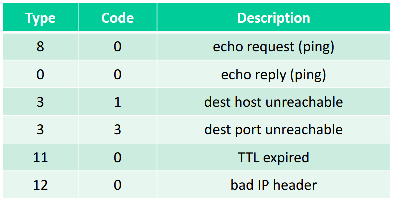

## A. Recap on Part I
- a software is basically a string of bits
- network layer is meant to establish connection between any two hosts in a network
- only offers reliability  on top of it (network layer itself is not reliable)
- all of the intermediate nodes have to be cooperating with each other

**Assumptions**
- for client-server model: server is always listening when we wish to connect
- the Internet is technically just a network that is interconnected

**Motivation**
- IP address is not associated with a host, but rather with a network interface
- IP Address are assigned by IANA in blocks (i.e. subnets), **not randomly**
	- allows for route aggregation
	- match by the *closest prefix* $\implies$ greatly reduces the # records a router needs to keep

- Routing and forwarding table are interchangeable w.r.t. routers

**Hierarchical Addressing**
- ISP assigned with a block of IP addresses and wants to split it up to $\geq 1$ organizations
- subnet mask enables us to match the network prefix
	- all the other router needs to know is how to send the packet to the edge router, and not the # subnets within the destination network of subnets.

- when transferring a subnet to a different ISP, may need to change the ISP block
	- alternative solution is to use a much more specific subnet (need to change the IP address block)

- IP address need to be represented as a binary string.
	- every router can have entries that match different set of IP addresses, but we take the one with the longest prefix
	- need to have information about the router's IP (default route) and the next hop's interface
## B. Abstract View of Intra-AS Routing, Graphs and Bellman-Ford
### Shortest Path Routing
- finding paths of connectivity between hosts on the network.

- we can take the problem as a graph problem
	- routers are the nodes
	- links are the edges

**Shortest Path**
- we want to find the shortest path
- take cost $=1$
- want to have the least # hops from one endpoint $A$ and another $B$

**Constraint**
- every path only has information about its immediate neighbour
- router $\alpha$ has no info that there is router $\gamma$ on the network
	- only aware that the cost to reach its neighbour $C$ is $2$

**Notation**
- $C_{x, y} \implies$ costs of the link from $X$ to $Y$
- $D_x(y) \implies$ cost of least-cost path from $X$ to $Y$

Neighbours can tell us their least-costing route to endpoint router $Z$
- principle of abstraction (tell don't ask) $\implies$ don't need to know how the neighbour reaches $Z$

### Bellman-Ford Equation
- bellman-ford / routing protocol runs on each router (the source)
- destination info will keep changing based on what is advertised
- takes some time to converge
	- there is no single starting or ending point

$$
D_{\alpha}(z) = min_{a \in N} \{c(\alpha, a) + D_{a}(z)\}
$$

**Inputs**
- $\alpha$ needs to know cost from each of its direct neighbour to router $\Omega$

## C. Distance Vector Model
- initially each router has no information about the destination (i.e. $\infty$ or not direct calculated)
- each router should advertise or broadcast what it is connected to, to the others (done by every router)

- we assume that all routers are turned on simultaneously at $t = 0$
- at $t = 1$, we use the bellman ford equation to compute the shortest path advertised by neighbours, then advertise again
#### C1. Iteration

#### C2. Computation
- perform addition operation of $\text{next hop to advertised} + \text{cost of current to next hop}$
- entries are not $\infty$ when the routing table converges
#### C3. Algorithm
- this is an *asynchronous algorithm*, but we assume the clocks of different machines are synchronous
- wait for a change in the local link cost  (from $\infty$ or something to a lower value) $\to$ recompute distance vector estimates using RV received from neighbour $\to$ if distance vector to any destination has change, then notify neighbours

- change in link cost ($\triangle$ cost)
	- link go down (cost becomes $\infty$)
	- congestion of link (cost goes up)

- if there is no change, there is no need for computation and notification

- the router constantly runs the routing algorithm
	- all the other router needs to know is that it has a routing table

- drop packet if cannot reach the link

**Routing Table**
- what is the next hop (the cost)
- the destination (expands as router stays on the network for longer)
#### C4. State Information Diffusion
We are looking at the past (it is already the old information), but we still process it because all the routing information will converge
- at $t= 0$s, the info of $c$'s state is only known at $c$ itself only
- at $t = 1$s, $c$'s state has propagated to $b$ and may influence distance vector computations of up to 1 hop away (i.e. at $b$)

- the diameter of the network is the upper bound of the network
## D. Routing Information Protocol (RIP)
- implements the distance vector algorithm
- sends the distance vector every 3 minutes
- most simple routing protocol that we can have
- RIP is an application layer protocol, not a network layer protocol
	- provides a service for the network layer

## E. Routing Algo Classification
- use of link state algorithms
	- don't restrict info only to immediate neighbours
	- all routers have complete knowledge of the complete topology

- for a router to function, it will need to have at minimum a forwarding table, don't need routing protocols
## F. Details of Intra-AS / Inter-AS Routing
**Intra-AS Routing**
- within the AS itself
- cost is the main consideration
- OSPF, RIP

**Inter-AS Protocol**
- amongst different ASes
- politics and policy is the main consideration
- BGP

**Network Layer Services**
- IP protocol -- Addressing conventions, datagram formatting, packet handling protocol
- Forwarding table -- who to forward incoming traffic towards
- Routing protocols -- Not necessary for
- a router to work, but a good to have

## G. Network Layer Components

#### G1. Data Plane

#### G2. Control Plane
- In the per-router control plane, each router is interacting with all other routers
- Forwarding Operations $\neq$ Routing Operations

## H. The Network Service Model, Network Layer in the TCP/IP Model
- we guarantee the shortest path
- provide a best-effort service, but **do not guarantee** anything
- hops in between need to have a transport layer protocol running on it, just have to have network layer protocols
## I. ICMP Protocol
- protocol that is used for *diagnostics by network engineers* and users
	- used for error reporting (i.e. unreachable host, network, port, protocol etc.)
- we may have used it before, but not be aware that we are using it
- stands for **Internet Control Message Protocol**
- used for echo request using the `ping` command (which is using ICMP)

- ICMP messages are carried in IP datagrams
	- the ICMP header starts after the IP header itself

- we can have Internet without ICMP (would not break without its absence)
	- a router or server not implementing ICMP is still considered to be a valid router
	- some servers may not even respond to the ICMP Echo request with a response
		- requires some resources to respond the incoming ICMP Echo requests

#### The ICMP Header
Has the following:
1. `Type` field
2. `Code` field
3. Checksum

#### The `ping` command
- creates an ICMP echo request destined to the IP address of the domain name supplied or just the IP address itself.
- ICMP server will respond with an Echo reply
	- \# bytes from `src_ip`: `seq_no` `ttl` `time`

- ping output will also show the aggregate details
	- min, max and average RTT timings in milliseconds (i.e. `ms`)
#### TTL Field
- the `TTL` field is present in the IPv4 header to ensure that packets don't stay in a network infinitely (drops the packet after a certain number of hops)
- Router drops the packet once the TTL becomes zero, TTL is decremented at each hop
#### `traceroute`
- uses the concept of TTLs
- sends a series of small packets across the network with different TTL values and attempts to display the route that the messages would take to get to a remote host
	- use the ICMP Echo response and TTL to find out if the TTL has expired (i.e. Type `11`, Code `0` as per above).
	- can determine where each router is place and how many hops between requestor and each of the routers (supposing all of them respond with the TTL expired ICMP packet)
	- can also see the points where there is communication to the Internet Exchange Points (IXPs)

- routers may send no reply due to VPN/Firewall policy blocking ICMP packets

- if we have multiple different entries in a single hop in ICMP output, it could mean that the router can route the packets through different paths to get to the same endpoint (for load balancing purposes).
	- provides resiliency to the network