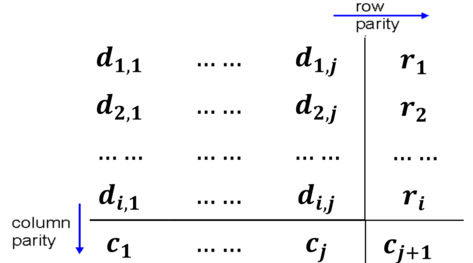

## A. Introduction to the Link Layer + Motivation
- Ultimate goal of networking is to send data between $\geq 2$ nodes via a cable
	- we can do so by connecting the $2$ nodes that wish to send (and receive) data $\implies$ drawing a cable from Alice to Bob

- Can expand the above problem to $n$ nodes, i.e. send data between $n$ nodes, so we will require **interconnection of $n$ nodes** (hop-to-hop communication)
	- each link **needs to be addressed** (the interfaces) $\implies$ to distinguish the interfaces
		- receiver has no way to know that the packet or frame belongs to him
		- addressed through framing through MAC addressing, Ethernet Frame standard and ARP

	- need to define a **protocol** for communications (i.e. set of rules to decide when and who can speak)
		- done through link access control protocols (i.e. random access, taking turns and channel partitioning)
		- sort of like the etiquettes of networks
			- give everyone chance to speak
			- don't speak until spoken to (don't interrupt)

	- need to handle errors (they are inherent because of segment collisions)
		- detection and reliability of frames (through parity check and CRC)
	
- *Main drawback*: This solution **does not scale** since we require $n-1$ links

- Bus topology is a network link $\implies$ packets will be heard throughout the network
	- is scalable and cheaper
	- common cable to which everyone is connected to

#### The Link Layer
- provides communication services between any two hosts (deals with single hop communications)

- IP datagram may travel through multiple routers (hops) and links before reaching its ultimate destination

- The Link Layer works by sending datagrams between adjacent nodes over a single link

- we are **not concerned** with the larger network, but rather the communication to adjacent nodes.

- Link layer technology changes at different hops
	- only **concerned with $1$ hop** (not sending data beyond a single hop)
	- $2$ hops $\implies$ network layer

### Possible Link Layer Services
**Framing**
- allows us to encapsulate datagram into a frame and include both the header and trailer

**Link Access Control**
- when nodes share a link, need to coordinates which nodes send frames, when?

**Error Detection**
- detecting error, does not mean that it requires retransmission
- recipient detects the presence of errors (may call for retransmission or simply drops the frame)

**Error Correction**
- receiver identifies and corrects bit errors w/o resorting to retransmission

**Reliable Delivery**
- seldomly used
- not really covered

### Where is Link/Physical layer Implemented
- on the network interface itself, even lower compared to the OS (which implements transport and network)
	- implemented on the NIC itself (which can be ethernet card or WiFi adapter etc.)

### Types of Network Links
1. Point-to-Point Link
	- sender and receiver are connected by dedicated link (i.e. PPP, SLIP etc.)
	- has no need for multiple access control

2. Broadcast Link
	- multiple nodes are connected to a shared broadcast channel (shared channel)
	- when frame transmits frame, channel broadcasts frame and every other node receives a copy $\implies$ we need some way of framing data and receiving it such that we **do not interfere** with or disrupt other's communications as well
	- has collisions, when a node receives $\geq 2$ signals at once

---
## B. Multi-Access Links and Protocols
- Multiple Access: who can talk, when they can talk and for how long
#### Motivation
- *Random access protocol:* **No coordination** is occurring, Collisions are possible
	- need to somehow have mechanisms to "recover from" and detect collisions
- *Taking Turns:* Each person gets *some time* to speak (using a token or a mic)
- *Channel Partition:* divide the channel into fixed smaller pieces (whether it be time or frequency of the channel) $\implies$ **partitioning** of channel resources
	- only a specific node can transmit on a fixed frequency (i.e. FM radio)
- Increasing complexity as we go down as humans (i.e. we have more rules required as we go down)

- As **engineers**, we will have less complexity towards the bottom, as there is more order
	- collisions are *harder to recover from* while coordinating and implementing scheduled messages are easier
	- often, the access is **controlled** by a central node or server
	- easier to **implement** (not so many edge cases to need to mitigate)

#### Ideal Multiple-Access Protocol
**Properties** (given a broadcast channel of rate $R$ bps)
1. *Collision Free*
2. *Efficient*: when only $1$ node wants to transmit, it can transmit at the **full rate** $R$ (the entire $R$ bps).
3. *Fairness*: when there are $m$ nodes that want to transmit, each can send at average rate of $\frac{R}{m}$
4. *Fully Decentralised*: should not be a special node to coordinate transmissions (no central coordination required)
5. ⚠️ Mandatory Requirement: ==***no** out-of-band signalling*==
	- *control signal and data* **goes through the same channel** (no using an external channel as a control path medium)
	- *recover* from all failures and errors on the **same channel**
	- principle of "don't use what is not allocated to you"
### B1. Random Access Protocols
- when node has something to send, just send (no need to coordinate)
- random access protocols specify how to **detect** collisions and how to **recover from** collisions
	- not always, as we see below
- protocols should identify how much of the $L$ bits are the relevant data (cannot be exceeded or reduced)
- Slotted and Pure ALOHA is used for wireless communication in theory, but only *pure ALOHA* was put into practice

- why decentralization?
	- collision can only be detected by the person who is transmitting (another nodes or the coordinating node cannot detect the collision)
#### 1. Slotted ALOHA
- has a clock
	- time is divided into slots of **equal length** $\implies \text{length} = \text{time to transmit 1 frame} = \frac{L}{R}$ (transmission delay)
	- nodes only transmit at the beginning of a slot and time is synchronized at each node
	
- *no coordination* among nodes
	- is decentralised as we don't need any server. Only thing we need to **synchronize** or coordinate is the **clock cycles**

- break data into frames of size $L$ bits and only transmit at a certain time slot (usually $\lt$ MTU)
	- every frame should be of data $L$ bits
##### Operation
1. When have frame to send, wait until beginning of next slot and transmit the entire frame in the slot
2. No Collision $\implies$ transmission successful
3. Collision $\implies$ retransmit the frame again
	- *Issue:* What would happen if the frame sent by two nodes collide and then they retransmit again?
		- *Solution:* retransmission **using "coin toss"** with probability $p$ (so unlikely to retransmit and collide and the same time), until frame is successfully transmitted
		- *Another Problem:* can retransmit for every time slot allocated (violate the property of efficiency and fairness)

4. Slotted ALOHA algorithm will continue on until all nodes transmit the frames that they want to send successfully
	

- Note: in second iteration above, none of the nodes had probability $0$ (i.e. to retransmit on the next time slot)
##### Properties
- is *not* a *collision free* protocol
- it is **efficient** $\implies$ utilization is $100\%$ (i.e. use the entire bandwidth of $R$), assuming that only one node is active at a time
	- by our own definition of efficiency, that is
- if is not efficient when there are **many** active nodes transmitting (max efficiency $\approx 37\%$) $\implies$ slots will be wasted due to them being empty
- it is a perfectly fair protocol
- it is fully decentralised beside having to coordinate the clocks across nodes
#### 2. Pure / Unslotted ALOHA
- **no time slots** with no synchronization
	- a frame transmits immediately when it wishes to send data
- interference is generated when there transmissions beginning at between $t_0 - 1$ and $t_0 + 1$ and $t_0$ 
	- *probability of collision* has actually **doubled** as compared with Slotted ALOHA

	
##### Operation
1. Send the entire frame
2. If no collision, assume data transmission is a success
3. If $\exists$ collision $\implies$ **wait for 1 frame transmission time** before retransmitting (happens until the entire frame is successfully transmitted)
	- like Slotted ALOHA (but this one has the 1 frame extra time of doing nothing), retransmission here is also done with probability $p$
##### Properties
- is *not* a *collision free* protocol
- it is **efficient** $\implies$ utilization is $100\%$ (i.e. use the entire bandwidth / has a throughput of $R$), assuming that only one node is active at a time
- if is not efficient when there are **many** active nodes transmitting (max efficiency $\approx \textbf{18}\%$) $\implies$ collisions **double** due to the lack of slots, and then need to also take into account **additional 1 frame transmission time**, so not efficient
	- reduced efficiency as compared to Slotted ALOHA
- it is a perfectly fair protocol
- it is fully decentralised beside having to coordinate the clocks across nodes
##### Major Drawback of Slotted/Pure ALOHA
- ==**cannot detect** a collision== 
	- all the nodes pay **no attention** to what is happening on the channel (i.e. if another node is transmitting at that point in time)
	- should by right, be able to detect if we are paying attention to the channel instead
	- flaw of random access (no rules, don't listen before transmitting)

**How do you detect a collision?**
- when we hear someone else (receive something that you did not transmit)
- when there is $\gt 1$ signal (usually $2$)
- wait for someone to stop transmitting before (re-) transmitting
#### 3. Carrier Sense Multiple Access
- listen before transmitting (check if channel is in use, i.e. someone is transmitting on the medium)
	- sensed to be **idle**: transmit the entire frame
	- sensed to be **busy**: *defer transmission* until channel is idle again
- *still have the issue of collision* because of **propagation delay** $D_{\text{prop}}$ on the rest of the nodes end when one nodes starts to transmit
	- Node B starts transmitting at $t = 0$
	- At $t=1$, another node D stars to transmit some data (as it senses the channel is free and has not yet received the data from node B due to $D_{\text{prop}}$)
	- detection of the previous node's (B) transmission is not instantaneous
	- it is too late by the time both B and D detect the collision

- the nodes decision to transmit is **not dependent on activity of other nodes** on the same broadcast channel

	

**Major Flaw**
- nodes ==**continues to transmit** even though it has detected the collision==
	- if B starts transmitting midway through A's transmission and detects the collision, then they will **still continue transmitting** all the way until the frame(s) are done transmitting (both end up as corrupt) $\implies$ finish transmitting the corrupt frame *regardless*
	- CSMA does not stop transmitting

#### 4. Carrier Sense Multiple Access / Collision Detection (CSMA/CD)
- Collisions are detected by the network interface card
- has the same properties as CSMA:
	- **channel idle:** transmit entire frame
	- **channel busy:** defer transmission
	- **collision detected:** stop transmission, retransmit after *random delay* period (see below)

	

- don't transmit the remaining frame 
	- **time delay** between collision detection and transmission abortion is for the **jamming signal**, which is used to alert other nodes of collision
		- jamming signal is not in the syllabus (allows all nodes in broadcast domain to be notified about the collision)
	- abort the transmission immediately to avoid wasting of the network bandwidth

**Retransmission Algorithm Improvements**
- the retransmission probability should **keep decreasing**
- However, probability of collision *stays the same* (but we want it to be decreased for each subsequent collision, to avoid subsequent collisions)
- we can reduce the probability further on each round of collision
	- more collisions in network $\implies$ heavier network load (so should implement longer back-off interval for more collisions)
		-  $\uparrow$ collision $\uparrow$ backoff
	- **exponential backoff** (unlike Slotted ALOHA which is linear backoff - sort of)
		- after the $n$ collision, we generate a random number from $K = \text{rand(}\{0, \: \ldots \:, \:  2^n -1\} \text{)}$ and wait for $K$ time
		- the higher **# collisions**, the longer the backoff time, resulting in a lower future rate /probability of collisions
		- probability of transmitting on the $n^{\text{th}}$ collision is $\frac{1}{2^n}$

	- is not deterministic since we are still *using probability*

- stop retransmitting the *given frame* after $\mathbf{16}$ **times** and continue transmitting next few frames

- If $p = 0 \implies$ retransmit immediately (depends on implementation, could be $1$ also or retransmit on $\geq 0.5$)
##### Minimum Frame Size
- frame size is variable in CSMA/CD, not like that of in ALOHA
- Both $B$ and $D$ cannot detect collisions when they are already done with transmitting (i.e. if the frame size is too small, but collided somewhere within the broadcast domain, due to propagation delay)lol
- 
	- we don't listen to detect a collision after we have finish transmitting (small frames)
	- makes us incapable of detecting such collisions which result in corruptions even though we technically should

**How do we solve this problem?**
- Transmission delay should be longer than the propagation delay for us to detect the collision?
$$
d_{\text{trans}} \geq 2 \times \text{max}(d_{\text{prop}})
$$
$\text{max}(d_{\text{prop}})$ guarantees that we can communicate to the farthest node
- need to ensure that the maximum reach (diameter of the network, is a function of length)
- Transmission delay proportional to **frame size**
	- Minimum Frame Size is $\textbf{64}$ **Bytes** (determined by Ethernet Protocol)
	- transmission delay decreases as we increase the bandwidth or $R$, so we can have a larger frame size

- Propagation delay proportional to the **diameter of the network** (length)
	- we cannot have an arbitrarily large network (defined by the longest cable $\implies$ limit to cable length)
	- longest cable length in which we can detect collision is $x$, where $x$ is arbitrary

- TCP's job is to recover from packet losses while Ethernet and by extension CSMA/CD's job to recover from corruption of frames / collisions
	- Ethernet does best effort transmission

#### Properties
1. Is **not collision free**, because it solves the very problem of collision (through detection)
2. It is **efficient**
3. It is **fair**
4. It is **decentralized**

### B2. Taking Turns Protocols
- how can we continue to have communication done effectively, even though the *link medium is shared*
- in between random access and channel partitioning protocols in terms of the **complexity** of the said protocols (have their own advantages as well)
#### 1. Polling
- polling protocol requires **one of the nodes** to be designated as the **master** and the remaining to be the slave nodes
- master node **polls** each of the slave nodes in a *round-robin fashion*
	- Underlying Principle: *don't speak unless spoken to*

- a poll is a special kind of frame that is sent to one endpoint device at a time.
	- slave would get the opportunity to send some amount of frames (permission to speak)
	- restrictive in nature (tight control of the network)

- there are certain use cases for this, even though it may seem nonsensical
	- *Bluetooth Protocol* (**phone or PC is the master**, the other devices are the slaves)
		- other devices are passive
##### Steps
1. Master informs node $1$ that it can transmit a maximum of $n$ # of frames
	1. each node will broadcast the data to be sent across the entire link
2. After node $1$ transmits its frames, the master tells the subsequent node (i.e. node $2$) that it can transmit up to $n$ frames
	1. this involved node $1$ **relinquishing the link** (cannot be sent until the next time)
3. Cycle continues
##### Properties
1. It is **Collision Free**: there will never be a collision as 
	1. the master will poll those who will speak
	2. the master will only poll node $i$ if all the other nodes have relinquished the ability to transmit
	3. master has the responsibility of ensure no collisions

2. We have a **higher efficiency**, but we still have the overhead associated with polling (use same channel for control messages)
	1. We *cannot fully obtain* the bandwidth $R$

3. It is **perfectly fair**, since we are going in a round-robin fashion and same amount of time to access the link

4. This algorithm is **not decentralized**, because it makes use of a master node for coordination
	1. the master node is a single point of failure
#### 2. Token-passing
- a special frame, a token is passed from one node to another sequentially
- the token has to be **held by a node before** the node is **permitted to transmit data** over the shared link (like a mic)
	- the node can broadcast the data to be transmitted

- if the node does not want to transmit, then it **passes the token on** to the subsequent node
	- the **order** of passing and **time taken** for the transmission by acquiring the token is **predetermined**
	- **maximum number of frames** that *can be sent* "per turn" is also predetermined, before relinquishing the token
	- each node **holds onto the token** only if it **has frames or data** to transmit

- used in token rings and FDDI (Fibre Distributed Data Interface)
##### Properties
1.  It is **Collision Free**: there will never be a collision as the node needs to obtain the token before transmitting
	1. no two systems would be accessing the shared link at any given time

2. We have a **higher efficiency**, but we still have the overhead associated with token passing
	1. cannot fully obtain the full bandwidth (never truly obtain the full bandwidth $R$)
	2. is quite close to $R$ if we have one fella transmitting, since we can pass on to next guy immediately instead of waiting for the timeslot to expire (unlike TDMA)

3. It is **perfectly fair**, assuming no one has mess around with the implementation of the pass the token algorithm
	1. in essence, every node should get an equal amount of time for whatever transmission to be performed

4. This algorithm is **fully decentralized** once the network is fully up and running
	1. token has to willingly relinquish the token (there is no master node for enforcement)
	2. there is no master node for coordination

##### Disadvantages
- the **loss of a token can be very disruptive** as we can have lost frames
	- frame getting corrupted is not rare in a network context
	- it is *costly to recover from the failure* (lots of effort spent, complexity of recovering from a corruption or failure)
	- introduces many system bugs (the code for token passing is rather complex)

- Nodal failures are a **single point of failure** and can **break** the whole ring
	- network topology for token passing is implemented as a ring
### B3. Channel Partitioning Protocols
#### Time Division Multiple Access (TDMA)
- arguably the **simplest** amongst the three
- simple as it has quite a few rules for communication to take place
- strictly allocates and divides the resources among nodes
	- resources being divided up is **time**
	- used commonly by GSM

- each nodes gets access to the link in "rounds" $\implies$ can only do the transmission when it is the node's turn, sort of in a round robin fashion as well
	- each node gets a fixed time slot length in each round
	- $\textbf{Length of time slot = 1 frame transmission time}$
	- once we have fixed the # time slots for $k$ nodes, we will need to redesign the entire system or algorithm if there is a need to do so.

- some time slots could be idle when the nodes do not send data
	- at the end of each round (collection of $k$ time slots for $k$ nodes), the same thing **starts again** (is cyclical in nature)

- pretty straightforward, we just divide and allocate the time accordingly
	- each node **cannot override** or utilize a time slot **reserved for another**, even if they (some particular node) have no data to transmit.

- "Frame" is an *overloaded terminology* in this case, where it can refer to either the time frame allocated or the frame of data to be sent via physical link.
##### Properties
1. It is **collision free**: since there is an allocated time to transmit

2. It is **highly inefficient**
	1. unused slots go **idle** (results in wasted time, capacity and hence lower efficiency)
	2. maximum throughput for a node is $\frac{R}{N}$, for $N$ nodes (regardless of whether each node wants to transmit or not)
		1. $= \frac{R}{N} \implies$ we have data to be transmitted
		2. $\lt \frac{R}{N} \implies$ we do not have data to be transmitted
		3. we will never get more than $\frac{R}{N}$ since we are technically chopping up the bandwidth $\implies$ each node gets access at only $\frac{1}{N}$ of the time (not so free to transmit as the random access protocols)

3. It is **perfectly fair** since every node gets an equal amount of time each round to transmit
	1. even if no need to transmit, time slot is still reserved

4. It is **decentralized**
	1. only coordination is to make sure the clocks of all nodes are synchronised

#### Frequency Division Multiple Access (FDMA)
- the channel spectrum is **sub-divided into frequency bands** and each node is assigned to a band
	- does not have to wait for a certain time or turn before transmitting
- multiple channels have data transmitting, but they do not interfere with one another
- unused transmission time in frequency bands go idle
- example: in FM radio (tune the radio to a particular channel or frequency) and satellite systems
##### Properties (exact same as in TDMA)
1. It is **collision free**: since there is an allocated time to transmit

2. It is **highly inefficient**
	1. unused slots go **idle**
	2. maximum throughput for a node is $\frac{R}{N}$, for $N$ nodes (regardless of whether each node wants to transmit or not)
		1. $= \frac{R}{N} \implies$ we have data to be transmitted
		2. $\lt \frac{R}{N} \implies$ we do not have data to be transmitted

3. It is **perfectly fair** since every node gets an equal amount of time each round to transmit

4. It is **decentralized**
	1. only coordination is to make sure the clocks of all nodes are synchronised

---
## C. Error Detection & Correction
### Motivation
- we are focusing on the underlying **error-prone link**
- when we send a datagram, the data being transmitted $D$ should carry *some redundant information* which can be used for **error-detection** and checking (and possibly correcting the error)
	- no guarantee that whatever is transmitted will be delivered

- receiver may receive $D'$, i.e. not the full and correct version of $D$.
	- receiver has to make a decision whether to accept and forward the packet up to the network layer **if no error detected** or discard the packet (if $D \neq D'$)
	- as a result, we want to have an error detection scheme that reduces the chances of missing the error

- error detection should be **probabilistic**
- error detection can be made better (improve accuracy by **increasing the size** or the number of bits in the **EDC**)

- Goal (quite impossible): achieve reliable data communication over an inherently unreliable network medium

- Error detection schemes are **not 100% reliable**
	- there may exist undetected errors

**Trivial Error Detection**
- copy and send the same exact data as a contiguous block right after the data itself
	- we send $2n$ bits instead of $n$ (send twice the data $\implies$ trade off for bandwidth)
		- is sending multiple copies of the packets good
		- ensure they have the same sequence number (duplicate detection)
	- chop into two halves and then do the error checking (bit-by-bit comparison)
### C1. Checksum (recap)
- treat the segment contents as a sequence of $16$-bit integers
- perform $1$'s complement on the sum of segment contents
	- remember to **invert the bits** after performing addition
### C2. Parity Bit Checks
- underlying principle is to detect half the errors
#### Single bit parity
- Notation: $D \implies$ the whole data segment to be sent, $d\implies$ **# bits** to be sent or transmitted
- want to ensure that # bits set to $1$ is **even**
	- if not so, we augment or "pad" the number of bits such that it fulfils the even criteria

- sender simply includes one additional bit
	- For **Even Parity Scheme**
		- if total # $1$s (**set bits**) is **even**, then set parity to $0$
		- if total # $1$s (set bits) is odd, then set parity to $1$ 
		- choose the value s.t. ==**total # of** $\mathbf{1}$s in the $d + 1$ **bits** is **even**==

- good for **detecting single bit errors** in data
	- detects an *odd number bit flips* (total # $1$s in the bit counts increasing or decreasing)
	- **cannot detect** an **even number** of single bit flips or error
	- not super reliable (can detect, cannot remediate)

- it **works exceptionally well** mathematically
	- probability of multiple bit errors if low, assuming that these errors are **independent of each other** (for $n$ bits, we have $\frac{1}{2^n}$), which is **not true** in reality
	- errors are *clustered together in bursts*  in reality (unable to detect, depending on the length of the bursts
		- $P(\text{Undetected}) \cong 50$
		- length of bursts can vary (either be even or odd)
#### 2D parity
- single bit parity is the *basis* for defining two-dimensional parity
- we arrange the data as a matrix of $i$ rows and $j$ columns
- we generate parity for each of the rows and columns separately (i.e. $r_i$ is generated from $d_{1,1}, \ldots, d_{1,j}$)
	

- we will obtain $i + j + 1$ parity bits in total
	- resultant $i + j + 1$ parity bots comprise the link-layer frame error detection bits.
	- has a corner parity bits, which can be generated by either the column or row parities
		- either column or row (should equate, but not both)

- we should use the same parity scheme across all rows and columns (decide on whether we want to use odd or even parity)

**Properties**
1. Can **detect and correct** single bit errors in data (up to one bit)
	1. using the $i^{\text{th}}$ row $j^{\text{th}}$ column bits (pinpoint the location and flip the bit to the correct one)

2. Can **detect** any two bit error in data (but cannot correct)
	1. can detect parity errors at two rows or two columns
	2. there is no unique way to fix the error (possible overlap with correct bits)

3. Overhead associated with sending the parity together with the data as well.
	1. cost of taking up some space as part of the MSS
### C3. Cyclic Redundancy Check (CRC)
- very much *misunderstood* error detection scheme
- simplistic, efficient and efficient
#### Motivation -- The Problem
Assumption that we wish to transmit **non-binary data** $D$, without any error to the receiver
- $D$ is a $d$ digit number is augmented by $R$ which is the checking code, of **size** $r$ digits, where $d, r \gt 0$
- $R$ is the *augmented data* known as the EDC, or ==***Error Detection and Correction bits***==, although we only use it for detection in this instance

- **Constraint:** 
	- small number of addition bits to be transmitted
	- generate the checking bits $R$, s.t. the sender can **compute** $R$ **easily** though the checking algorithm for the sender of the message $D$
	- make sure that the **receiver** can also **easily verify** the integrity of $D$, through the use of $R$ (errors should be easily detectable by the receiver)
#### Motivation -- The Solution
- consider the **mathematical properties of division** (remainder and quotient)
	- we shall use a special $r$-digit (of size $r$) number $G$, known as the Generator.

- using modulo arithmetic by $k$, where $D \geq k$, we observe that there can be bit flips that result in the check matching.
- every number sent by the sender is guaranteed to be divisible by $G$ (see CS1231S divisibility property)
	- each number is a multiple of $7$
	- what is sent looses the meaning of the original data if we use it standalone
		- $7 \: | \: 21027839$ and $7 \: | \: 21027846$

	- we can appending a new digit (or a small number of digits as well) to the original data 
		- we can vary the size of the generator i.e., $r = 1 \to 3$  
##### Steps 
Ensure the data is not corrupted (extract the original message)
1. Get a Generator $G$, each number we send is a multiple of $G$
2. Create a new number $X$ by appending `9` to $D$ (string concat)
3. Find the remainder of $X \div G$
	1. $Y = X\:  \%\:  G$ (X mod G)

4. Determine the message $M$ being transmitted using $M = X - Y$
5. Check if $M \text{ mod } G = 0$
### The CRC Scheme
**All fields are binary in nature**
- $D$ is the data bits which is to be viewed as a binary number
- $G$ is of size $r + 1, r \in \mathbb{Z}^+$
- $R$ is the $r$ bit CRC
	- CRC-32 uses a $32$-bit error detection scheme ($G$ will be 33 bits in this case)

**Usage of Modulo-2 Arithmetic**
- there is no carry for addition or borrow for subtraction (from the relatively higher power $k + 1^{\text{th}}$ position)
- addition and subtraction of numbers is **identical** to XOR operation
	- $x + y = x - y = x \oplus y$
- just need to perform bitwise XOR if there are multiple digits
	- we can parallelly implement the XOR operations (can be easily implemented on hardware itself)

- modulo division is essentially *repeated subtraction*, in essence
	- conduct repeated, just need to match up $r + 1$ bits at a time (or the size of $G$)

**Append with $r$ 0s to $D$**
- note that for the **generator**, the MSB should always be set to $1$ to ensure that its length is $(r + 1)$ and not $(r)$
- CRC is the remainder (limited to $r$ bits only)
	- can directly concat the bits (i.e. we send $(D,R)$)

**Assumptions**
- both the sender and receiver knows $G$

**Receiver**
- take the tuple $(D,R)$ and performmod-2 division $G$ again to yield $000_2$
	- if non-zero remainder, then there is no error detected
### Properties of CRC
- **easy to implement** on hardware since we can parallelize the XOR operations

- powerful error-detecting that is **widely used in practice** (i.e. Ethernet, WiFi etc.)
	- can detect all **odd** number of **single bit errors*
	- can detect all burst errors of **up to $r$ bits**
	- can also detect all burst errors **$\gt r$ bits** with probability $1- 0.5^r$
		- gets exponentially more as we increase number of bits (tends to $p = 1$ as $r$ increases and is a big number)

- CRC is also known as the *Polynomial Code*
	- $k$-bit frame regarded as the coefficient list for a polynomial with $k$ terms, ranging from $x^{k - 1}$
	- the LSB has the degree $=0$ and the MSB has the degree $= k - 1$