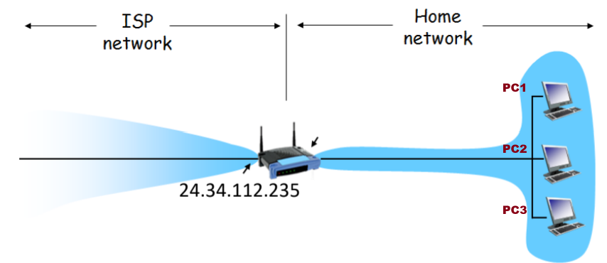
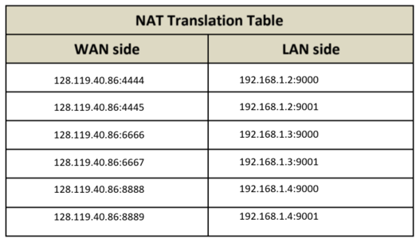
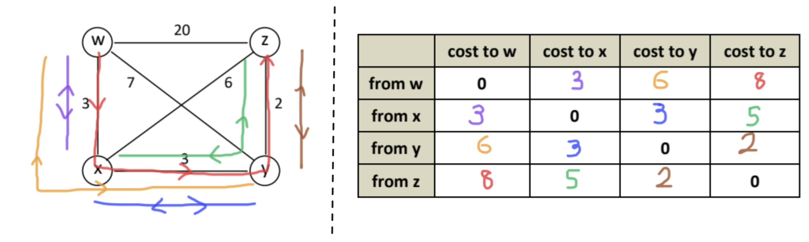
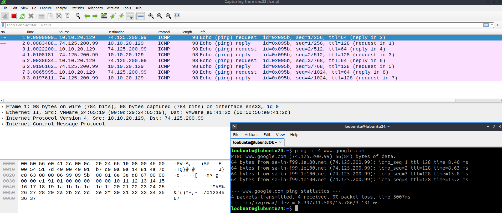
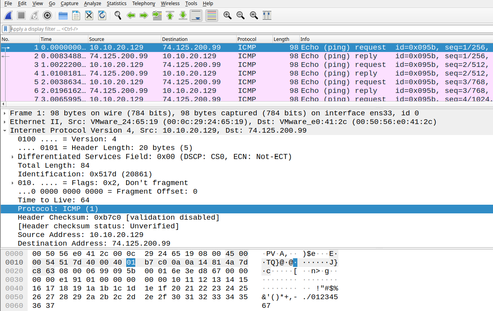

#### Question 1a) Give an example IP address assignment to all interfaces in this home network.

- PC 1: `192.168.1.2`
- PC 2: `192.168.1.3`
- PC 3: `192.168.1.4`

#### Question 1b) Suppose each host has two ongoing TCP connections, all to port `80` of a server at `128.119.40.86`. Provide example corresponding entries in the NAT translation table.

#### Question 2) Consider sending a 1500-byte IP datagram into a link that has an MTU of 500 bytes. Suppose the original datagram is stamped with the identification number 422. Also assume that IP header is 20 bytes long.

#### a) How many fragments will be generated?
$$
\begin{aligned}
\text{MSS} &= 500 - 20 = 480 \\\\
\text{\# fragments generated} &= \frac{1500}{480} = 3.125 \approx \boxed{4} \text{ fragments}
\end{aligned}
$$
#### b) What is the length of each fragment (including IP header)?
$$
\begin{aligned}
\text{Length of Fragments 1 to 3} &= 500 \text{ bytes} \\
\text{Length of Fragments 4} &= 20 + (1500 - 480 \times 3) \\
&= 80 \text{ bytes}
\end{aligned}
$$
#### c) What are the values of identification number, offset and flag in each fragment?
$$
\begin{aligned}
\textbf{Fragment 1:} \\
&\text{ID Number: } 422 \\
&\text{Offset: }  0 \\
&\text{Flag: } 1 \\\\
\textbf{Fragment 2:} \\
&\text{ID Number: } 422 \\
&\text{Offset: }  480 \div 8 = 60 \\
&\text{Flag: } 1 \\\\
\textbf{Fragment 3:} \\
&\text{ID Number: } 422 \\
&\text{Offset: }  60 + (480 \div 8) = 120 \\
&\text{Flag: } 1 \\\\
\textbf{Fragment 3:} \\
&\text{ID Number: } 422 \\
&\text{Offset: }  120 + (480 \div 8) = 180 \\
&\text{Flag: } 0
\end{aligned}
$$

#### Question 3) The following diagram shows a simple network topology with 4 nodes. The links in the diagram are labelled with the cost of each link. The nodes run distance vector routing protocol. The protocol has terminated, and each node knows the cost of the minimum cost path to every other node.

#### Question 4i) Within the IP packet header, what is the value in the upper layer protocol field?

A: `ICMP`
#### Question 4ii) Which fields in the IP datagram always change from one datagram to the next within this series of ICMP messages sent by your computer?
A: `Identification`, `Header Checksum`

`Flags` and `TTL` (???)